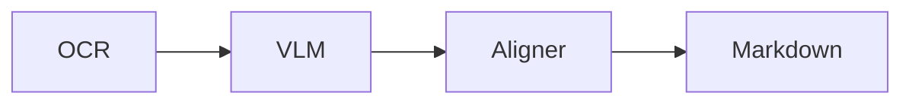

<div align="center">

# ahnafnafee.dev

**An SEO-optimized personal portfolio + MDX blog template — Next.js 16 · React 19 · TypeScript · Tailwind CSS v4**

The personal site of Ahnaf An Nafee, plus a fork-ready starting point for developers, researchers, and engineers who want a fast, well-structured portfolio with batteries-included SEO, JSON-LD schema, AI-search optimization (llms.txt), and a content pipeline driven by MDX.

[](https://www.ahnafnafee.dev)
[](https://github.com/ahnafnafee/ahnafnafee.dev/actions/workflows/ci.yml)
[](LICENSE)
[](https://nextjs.org)
[](https://yarnpkg.com)

[Use this template](https://github.com/ahnafnafee/ahnafnafee.dev/generate) · [Live demo](https://www.ahnafnafee.dev) · [Research](https://www.ahnafnafee.dev/research) · [Blog](https://www.ahnafnafee.dev/blog) · [Report bug](https://github.com/ahnafnafee/ahnafnafee.dev/issues/new)

</div>

---

## Table of contents

- [Why this repo](#why-this-repo)
- [Features](#features)
- [Tech stack](#tech-stack)
- [Quick start](#quick-start)
- [Project structure](#project-structure)
- [Customizing the template](#customizing-the-template)
- [Authoring content](#authoring-content)
- [Scripts](#scripts)
- [Deployment](#deployment)
- [Testing &amp; CI](#testing--ci)
- [About the author](#about-the-author)
- [License](#license)

---

## Why this repo

Most personal-portfolio templates skimp on SEO, leave structured data half-implemented, and break the moment Google's AI Mode or Perplexity tries to crawl them. This one is the opposite: every page emits a single connected `@graph` of schema.org entities, the canonical `Person` is referenced by `@id` across the site, OG images are normalised to 1200×630, and an `llms.txt` manifest is regenerated on every build.

Use it as your portfolio. Fork it as a template. Read the source as a reference for what a SEO-complete Next.js 16 site looks like in 2026.

---

## Features

### SEO &amp; AI search

- **`@graph` JSON-LD** on blog, portfolio, and research detail pages — `BlogPosting` / `SoftwareSourceCode` / `ScholarlyArticle` + `WebPage` + `BreadcrumbList`, all interconnected by `@id`. Research entries also emit `Periodical` / `CreativeWork` for `isPartOf` (conditioned on venue status), structured `Person` author nodes with `affiliation` and ORCID `identifier`, and DOI / arXiv / ResearchGate `PropertyValue` identifiers when present.
- **Canonical `Person` entity** (`/#person`) referenced from every author/publisher slot. Full sameAs/knowsAbout/credentials live only on `/`; everywhere else uses a slim reference.
- **`ProfilePage` JSON-LD** on the home page and `/resume`, with `mainEntity` deduplicated via `@id`.
- **`CollectionPage` + `ItemList`** schema on topic archives.
- **`FAQPage` and `HowTo`** MDX components for evergreen posts (`<FAQ items={...}/>`, `<HowTo steps={...}/>`).
- **Open Graph + Twitter cards** at 1200×630 with explicit alt text and `image/png` MIME hints. Per-page metadata via `generateMetadata`.
- **Dynamic OG images** at `/api/og` rendered with `@vercel/og` (terminal-themed, cache-busted by deploy SHA).
- **`og:see_also`** for related posts; **`hreflang`** alternates; **`<link rel="me">`** for IndieAuth/Mastodon identity.
- **`llms.txt`** auto-generated on every build with a per-post manifest (title, summary, topics, dates) so AI search engines see a curated map of the site.
- **Sitemap** with frontmatter-driven `lastmod`, `<image:image>` entries, and explicit AI-crawler allowlists in `robots.txt` (GPTBot, ClaudeBot, PerplexityBot, OAI-SearchBot, Bytespider, CCBot, …).
- **WebSite `SearchAction`** wired to `/blog?q=` (the search box honours the URL param so the schema is truthful).

### Content

- **MDX** for blog, portfolio, and research (no CMS, no database). Frontmatter parsed by `gray-matter`.
- **Academic project pages** at `/research/[slug]` — title, structured authors + affiliations, venue, action-button row (Paper / Code / Video / arXiv / ResearchGate / Dataset / BibTeX), full-bleed teaser, abstract, MDX body, copy-to-clipboard BibTeX. Listing page groups entries by section (top-tier, conferences, journals, workshops, others).
- **Reading time + word count** via `reading-time`, fed into BlogPosting `timeRequired`/`wordCount`.
- **Mermaid diagrams**, **KaTeX math**, **Prism syntax highlighting**.
- **Custom MDX components**: `<TLDR>`, `<KeyPoints>`, `<FAQ>`, `<HowTo>`, `<ContentImage>` (lightbox-enabled), `<Mermaid>`.
- **Related / adjacent post navigation** at the bottom of every blog post.
- **Topic archive pages** auto-generated from frontmatter `topics`.
- **RSS** at `/rss.xml` (summaries) and `/rss-full.xml` (full content) with `<link rel="alternate">` discovery in `<head>`.

### Design system

- **shadcn/ui** (radix-nova style) as the single primitive layer. Components live under `src/components/ui/` and are managed by the shadcn CLI (`npx shadcn@latest add <name>`); rerun with `--diff` to merge upstream updates without losing local edits.
- **Theme bridge** in `src/styles/globals.css` `@theme inline` — shadcn semantic tokens (`--primary`, `--background`, `--foreground`, `--muted`, `--border`, `--ring`) map onto the legacy blue-primary / neutral-theme palette in OKLCH so legacy classes (`bg-primary-500`, `text-theme-700`) and shadcn classes (`bg-primary`, `text-foreground`) render identically across light/dark.
- **Site composition components** under `src/components/site/` (Header, Footer, Nav, Hero, Searchbar, BackToTop, MobileNav, ThemeMenu, link/image wrappers, AppLayoutPage) — bespoke pieces that compose shadcn primitives + project state.
- **Single primitive ecosystem** — `radix-ui` (shadcn's base), `lucide-react` (icons inside shadcn), `sonner` (toasts), `tw-animate-css` (animations), `class-variance-authority` (variants), `tailwind-merge` (className merging).
- **Typography** — Google Sans loaded from Google Fonts with a system-font fallback chain (`system-ui, -apple-system, BlinkMacSystemFont, 'Segoe UI', Roboto, …`). Local Inter `@font-face` is kept as a deeper fallback so the page never FOUCs.

### Performance

- **Core Web Vitals attribution** for CLS, LCP, **INP**, FCP, TTFB via Vercel Speed Insights.
- **`next/image`** with WebP/AVIF, 5 quality tiers, 1-year `minimumCacheTTL`, responsive `sizes`.
- **Lazy-loaded** Mermaid (~100KB), `react-image-lightbox`, Giscus comments (deferred via `IntersectionObserver` until the section enters the viewport).
- **Pageviews batched** in a single API call instead of N+1 fetches.
- **PWA** via `@ducanh2912/next-pwa` (the maintained next-pwa fork — Workbox 7, Next.js 16-compatible) with offline support; **Strict CSP**, HSTS, all OWASP-aligned security headers.

### Tooling

- **TypeScript** strict-mode, `@/*` path alias.
- **ESLint flat config** (`eslint.config.mjs`, replacing the deprecated `next lint`).
- **Prettier** with `@ianvs/prettier-plugin-sort-imports` (actively maintained successor to `@trivago`) + `prettier-plugin-tailwindcss`.
- **shadcn CLI** for primitive sync — `npx shadcn@latest add`, `--diff`, `--dry-run`.
- **Vitest** suite (48 tests, ~1.7s) covering schema generators, sorters, content readers. Vite resolves `@/*` paths via the native `resolve.tsconfigPaths: true` (no plugin).
- **JSON-LD validator** (`yarn validate:json-ld`) walks the build output and verifies every `<script type="application/ld+json">` block.
- **Alt-text auditor** (`yarn audit:alt-text`) flags weak `alt` attributes in MDX.
- **GitHub Actions CI**: type-check + lint + test + build + JSON-LD validation on every push/PR.
- **Yarn 4** via Corepack, with a `vercel.json` `installCommand` (`corepack enable && corepack prepare yarn@4.14.1 --activate && yarn install --immutable`) so deploy hosts actually run Yarn 4 and honour the lockfile.

---

## Tech stack

| Layer            | Choice                                                                |
| ---------------- | --------------------------------------------------------------------- |
| Framework        | Next.js 16 (App Router) + React 19                                    |
| Language         | TypeScript                                                            |
| Styling          | Tailwind CSS v4 (with `@tailwindcss/typography`)                      |
| Design system    | shadcn/ui (radix-nova) on `radix-ui`                                  |
| Icons            | `lucide-react` (shadcn) + `react-icons` (legacy site components)      |
| Toasts           | `sonner`                                                              |
| Fonts            | Google Sans (Google Fonts) + Inter (local @font-face fallback)        |
| Content          | MDX (`next-mdx-remote/rsc`) + `gray-matter`                           |
| Markdown plugins | remark-gfm, remark-math, rehype-prism-plus, rehype-slug, rehype-katex |
| Comments         | Giscus (deferred)                                                     |
| Diagrams         | Mermaid (lazy)                                                        |
| Math             | KaTeX                                                                 |
| Image CDN        | ImageKit                                                              |
| Analytics        | Vercel Analytics + Speed Insights                                     |
| Logging          | Axiom (next-axiom)                                                    |
| Sitemap          | next-sitemap (custom config)                                          |
| OG images        | @vercel/og                                                            |
| PWA              | @ducanh2912/next-pwa (Workbox 7)                                      |
| Testing          | Vitest + happy-dom + @testing-library/react                           |
| Lint             | ESLint 9 (flat config) + eslint-config-next                           |
| Format           | Prettier 3 + `@ianvs/prettier-plugin-sort-imports`                    |
| Package manager  | Yarn 4 (Corepack)                                                     |
| Hosting          | Vercel (primary) + static export for any CDN                          |

---

## Quick start

### Prerequisites

- Node.js 20 or newer (22+ recommended)
- [Corepack](https://nodejs.org/api/corepack.html) enabled (`corepack enable`) — pulls Yarn 4.14.1 automatically from the `packageManager` field.

### Local development

```bash
git clone https://github.com/ahnafnafee/ahnafnafee.dev.git
cd ahnafnafee.dev
corepack enable
yarn install
yarn dev               # http://localhost:3000
```

### Environment variables

Create `.env.development.local`:

```env
NEXT_PUBLIC_SITE_URL="http://localhost:3000"
# Optional: cache-bust OG images per deploy
# NEXT_PUBLIC_OG_VERSION="dev"
```

For production (Vercel auto-injects `VERCEL_GIT_COMMIT_SHA`, no extra config needed).

### Production build

```bash
yarn build              # Vercel-style build
yarn export             # Static export to ./out (no API routes)
yarn start              # Serve the production build locally
```

---

## Project structure

```
src/
├── app/                          # Next.js App Router
│   ├── layout.tsx                # Root layout, WebSite + Navigation JSON-LD, viewport, themeColor
│   ├── page.tsx                  # Home (ProfilePage + Person)
│   ├── blog/
│   │   ├── page.tsx              # Blog list
│   │   ├── [slug]/page.tsx       # Blog detail (BlogPosting @graph)
│   │   └── topics/               # Topic index + per-topic archives
│   ├── portfolio/
│   │   ├── page.tsx              # Portfolio list
│   │   └── [slug]/page.tsx       # Portfolio detail (SoftwareSourceCode @graph)
│   ├── research/
│   │   ├── page.tsx              # Research list (grouped into top-tier / conferences / journals / workshops / others)
│   │   └── [slug]/page.tsx       # Research detail (ScholarlyArticle @graph)
│   ├── resume/page.tsx           # Resume / ProfilePage
│   ├── api/                      # OG image, pageviews, revalidate, content APIs (incl. /api/research)
│   ├── rss.xml/route.ts          # RSS summary feed
│   └── rss-full.xml/route.ts     # RSS full-content feed
├── components/                   # UI + content components
│   ├── ui/                       # shadcn/ui primitives (managed by `npx shadcn@latest add`)
│   ├── site/                     # Bespoke composition components (Header, Footer, Nav, AppLayoutPage, Hero, Searchbar, BackToTop, …)
│   ├── content/mdx/              # MDX overrides (Pre, Code, ContentImage, TLDR, FAQ, HowTo, …)
│   ├── content/research/         # Research-page sections (HeadingResearch, ResearchOverview, ResearchNews, ResearchAreas, ResearchSections, ComingSoonImage, SectionHeading, …)
│   └── SEO/Breadcrumbs.tsx
├── data/
│   ├── blog/*.mdx                # Blog posts (slug = filename)
│   ├── portfolio/*.mdx           # Portfolio entries
│   └── research/*.mdx            # Research entries (academic project pages)
├── libs/
│   ├── constants/site.ts         # SITE_URL, SITE_NAME, PERSON_ID, etc. — single source of truth
│   ├── seo/                      # personSchema, faqSchema, howToSchema
│   ├── metapage/                 # generateOgImage helper
│   ├── sorters/                  # getNewestBlog, getAdjacentPosts, etc.
│   └── intl/                     # dateFormat, dateStringToISO
├── services/content/             # MDX readers (getContents, getContentBySlug, getContentHeaders)
└── types/index.d.ts              # Frontmatter types for Blog, Portfolio, Research, Snippet

scripts/
├── generate-llms-txt.js          # Builds public/llms.txt from MDX frontmatter (prebuild)
├── validate-json-ld.js           # Walks .next/out, validates JSON-LD blocks
├── audit-alt-text.js             # Reports weak alt attributes in MDX
├── export-prepare.js             # Moves /api aside before static export
└── export-cleanup.js             # Restores /api after static export

custom-next-sitemap.js            # Sitemap + robots.txt generation (frontmatter-driven lastmod)
.github/workflows/ci.yml          # Lint + type-check + test + build + JSON-LD validate
```

---

## Customizing the template

### 1 · Identity (the one file every fork needs to edit)

`src/libs/constants/site.ts`:

```ts
export const SITE_URL = process.env.NEXT_PUBLIC_SITE_URL?.trim() || 'https://your-domain.com'
export const SITE_NAME = 'Your Name'
export const SITE_DESCRIPTION = '…'
export const SITE_AUTHOR = {
  name: 'Your Name',
  email: 'you@example.com',
  twitterHandle: '@your_handle',
  githubUsername: 'your-github'
}
export const TWITTER_HANDLE = SITE_AUTHOR.twitterHandle
export const PROFILE_IMAGE = 'https://…/your-avatar.png'
export const PERSON_ID = `${SITE_URL}/#person`
```

### 2 · Person schema

`src/libs/seo/personSchema.ts` — `getPersonNode()` returns the full Person body emitted on `/`. Update `sameAs`, `jobTitle`, `worksFor`, `alumniOf`, `knowsAbout`, `hasCredential` to match your background.

### 3 · Social links

`src/libs/constants/social.ts` — array of `{ title, href }` used by the home page and footer.

### 4 · Robots / AI crawlers

`custom-next-sitemap.js` — the `policies` array in `robotsTxtOptions`. Add or remove user-agents here. The committed list explicitly allows GPTBot, Claude-Web, ClaudeBot, anthropic-ai, OAI-SearchBot, Perplexity{Bot,User}, Google-Extended, Applebot-Extended, Bytespider, CCBot, cohere-ai, and meta-externalagent.

### 5 · Branding assets

- Replace `public/static/avatar.png`, `public/static/logo.png`, `public/static/404.svg`.
- Update `public/manifest.json` (`name`, `short_name`, `theme_color`, icons).
- Replace ImageKit OG image URLs in page metadata (or repoint them at your own CDN).
- The dynamic OG renderer at `src/app/api/og/route.tsx` is style-customisable.

### 6 · Domain &amp; canonical URL

- `SITE_URL` constant (above).
- `custom-next-sitemap.js` defaults to the canonical hostname; override at build time with `SITE_URL=https://example.com yarn build`.
- `next.config.js` `images.remotePatterns` — add your domain if you serve images from it.

### 7 · Content

Add posts to `src/data/blog/<slug>.mdx`, projects to `src/data/portfolio/<slug>.mdx`, and academic work to `src/data/research/<slug>.mdx`. The filename becomes the URL slug. See [Authoring content](#authoring-content).

### 8 · CI

`.github/workflows/ci.yml` runs on every push/PR. No secrets required for the default pipeline.

---

## Authoring content

### Blog post frontmatter

```yaml
---
title: 'How I built a privacy-first OCR pipeline'
slug: 'local-llm-pdf-ocr' # optional — filename wins
summary: 'Pairing Surya layout detection with local VLMs and a Needleman-Wunsch aligner.'
featured: true # surfaces on the home page
author_name: 'Ahnaf An Nafee'
github_username: 'ahnafnafee'
published: '04/26/2026' # MM/DD/YYYY
updated: '05/02/2026' # optional, drives dateModified + sitemap lastmod
topics: ['OCR', 'LLM', 'Vision Language Models']
keywords: ['ocr', 'local llm', 'vlm', 'pdf']
related: ['mesh-decimation-benchmark'] # other slugs for "related posts"
thumbnail: 'https://ik.imagekit.io/.../cover.jpg' # optional, OG image fallback
---
## TL;DR

A 60–120 word summary at the top — front-loaded for AI search citations.

…
```

### Portfolio entry frontmatter

```yaml
---
title: 'Bookworm'
date: '05/01/2022'
updated: '02/01/2024' # optional
featured: true
category: 'software' # 'software' | 'game'
summary: 'Mobile-first website for tracking books you have read.'
image: 'https://ik.imagekit.io/.../bookworm_og.png'
stack: ['react', 'next.js', 'typescript', 'tailwindcss', 'supabase']
link:
  github: 'https://github.com/you/bookworm'
  live: 'https://bookworm-app.vercel.app'
---
```

### Research entry frontmatter

```yaml
---
title: 'Performance Analysis of 3D Mesh Simplification Algorithms'
summary: 'A short blurb for cards / OG / SEO description.'
abstract: >- # YAML folded scalar — single paragraph
  The verbatim paper abstract (~150-300 words). Renders in a styled
  card above the body on the detail page.
authors:
  - name: 'Ahnaf An Nafee'
    url: 'https://www.ahnafnafee.dev'
    email: 'aannafee@gmu.edu'
    affiliations: [1] # 1-based indices into the entry's affiliations array
    corresponding: true
affiliations:
  - name: 'George Mason University'
    location: 'Fairfax, Virginia, USA'
    url: 'https://www.gmu.edu'
venue:
  name: 'CS700 — Research Methodology in Computer Science, Course Project'
  short: 'GMU CS700'
  year: 2025
  status: 'tech-report' # preprint | under-review | accepted | published | workshop | tech-report
published: '12/08/2025'
featured: true # surfaces on the home page
new: true # renders a "NEW" badge inline with the title on the listing card
comingSoon: true # OPTIONAL: renders a "Coming soon!" pastel placeholder in place of the listing thumbnail (for conditionally accepted / pre-publication entries that don't have a teaser yet)
section: 'others' # top-tier | conferences | journals | workshops | others
topics: ['3D Graphics', 'Mesh Simplification']
keywords: ['mesh decimation', 'QEM', 'vertex clustering']
thumbnail: 'https://ik.imagekit.io/.../mesh-decimation.jpg'
teaser: 'https://raw.githubusercontent.com/.../teaser.png' # high-res hero figure on detail page
teaserCaption: 'Visual comparison of decimation results across CAD and organic meshes.'
links:
  paper: 'https://www.researchgate.net/publication/...'
  code: 'https://github.com/...'
  researchGate: 'https://www.researchgate.net/publication/...'
  # arxiv / video / slides / dataset / supplementary / demo / project — all optional
identifiers:
  # doi / arxivId / researchGateId — fed into ScholarlyArticle.identifier
  researchGateId: '400103838'
bibtex: |
  @misc{annafee2025meshsimplification,
    author = {Ahnaf {An Nafee}},
    title  = {…},
    year   = {2025}
  }
---
```

The detail page renders the structured fields in the hero (status chip from `venue.status`, authors with affiliation superscripts, venue line, action-button row driven by `links` and `bibtex`). Authors matching `SITE_AUTHOR.name` are bolded. The `bibtex` field renders as a copy-to-clipboard code block anchored at `#bibtex`.

**Author / affiliation superscripts are conditional**: `*` (corresponding author) only renders when there are 2+ authors and at least one is `corresponding: true`; `¹ ² ³` (affiliation indices) only render when there are 2+ affiliations. Single-author / single-affiliation entries skip both — no orphan markers. When the markers do show, they carry hover tooltips (native `title` + `cursor-help`) that resolve to the actual affiliation names so the meaning is clear without scrolling.

The research listing page (`/research`) renders an Overview paragraph, a date-column News timeline, and a colored chip row of Research Areas above the section-grouped listings. Section headings across the page (Overview / News / Research Areas / Top-Tier Venues / Conferences / Journals / Workshops / Others) share a single `<SectionHeading>` component (`text-lg md:text-xl`, `font-bold`, `text-black dark:text-white`, bordered bottom).

### Special MDX components

```mdx
<TLDR>Three sentences distilling the post — what LLMs cite first.</TLDR>

<KeyPoints items={['First', 'Second', 'Third']} />

<FAQ
  items={[
    { q: 'How fast is it?', a: '~30 ms per page on a 4090.' },
    { q: 'Does it run offline?', a: 'Yes — no network calls in the default config.' }
  ]}
/>

<HowTo
  name='Set up local OCR'
  totalTime='PT15M'
  steps={[
    { name: 'Install dependencies', text: 'pip install surya-ocr olmocr' },
    { name: 'Run the pipeline', text: 'python ocr.py path/to/file.pdf' }
  ]}
/>

<ContentImage src='https://ik.imagekit.io/.../diagram.png' alt='Architecture diagram' />
```



```math
y = \sigma(Wx + b)
```

---

## Scripts

| Command                                                | What it does                                                                                     |
| ------------------------------------------------------ | ------------------------------------------------------------------------------------------------ |
| `yarn dev`                                             | Dev server with Turbopack                                                                        |
| `yarn dev:webpack`                                     | Dev server forced to webpack (fallback for Mermaid hot reload edge cases)                        |
| `yarn build`                                           | Production build (also runs `prebuild` → `generate-llms-txt.js` and `postbuild` → sitemap)       |
| `yarn export`                                          | Static export to `./out` — temporarily moves `src/app/api/` aside so Next can `output: 'export'` |
| `yarn export:university`                               | Static export with a `BASE_PATH` (used for the GMU university mirror)                            |
| `yarn start`                                           | Serve the production build on `:5000`                                                            |
| `yarn lint` / `yarn lint:fix`                          | ESLint flat config                                                                               |
| `yarn type-check`                                      | `tsc --noEmit`                                                                                   |
| `yarn test` / `yarn test:watch` / `yarn test:coverage` | Vitest                                                                                           |
| `yarn validate:json-ld`                                | Walk built HTML, verify every JSON-LD block parses + has `@context` and `@type`/`@graph`         |
| `yarn audit:alt-text`                                  | Report weak `alt` attributes in MDX                                                              |
| `yarn analyze`                                         | `@next/bundle-analyzer` build report                                                             |
| `yarn format`                                          | Prettier on `**/*.{js,jsx,ts,tsx,md,mdx,json}`                                                   |
| `yarn commit`                                          | Commitizen prompt (conventional commits)                                                         |
| `npx tsx indexing/sendIndexingRequest.ts`              | Submit URLs to the Google Indexing API (requires `indexing/service_account.json`)                |

---

## Deployment

### Vercel (recommended)

Zero-config — Vercel detects Next.js and uses the `installCommand` from `vercel.json` (`corepack enable && corepack prepare yarn@4.14.1 --activate && yarn install --immutable`) so Yarn 4 actually runs (the explicit `corepack prepare` step is required because `corepack enable` alone doesn't reliably switch the active yarn binary on Vercel's image — without it, Vercel falls back to Yarn 1.22 and silently rewrites the lockfile). Set `NEXT_PUBLIC_SITE_URL` to your production domain in the Vercel project settings.

### Static export

```bash
yarn export
# Serve ./out on any static host: GitHub Pages, S3, Netlify, Cloudflare Pages, …
```

The export pipeline (`scripts/export-prepare.js`) temporarily moves API routes aside because Next.js cannot static-export a tree with handlers. `scripts/export-cleanup.js` restores them.

### ISR

`/api/revalidate?secret=<SECRET>&slug=/blog/<slug>` — call this from a CMS webhook or `gh actions` to bust ISR for a single page. The secret is `NEXT_PUBLIC_SECRET` or `SECRET_KEY`.

---

## Testing &amp; CI

`yarn test` runs the Vitest suite (48 tests across 8 files in ~1.7s):

- **SEO library** — `personSchema`, `faqSchema`, `howToSchema`, `generateOgImage` (env stubbing for cache-busting fallbacks).
- **Sorters** — `getNewestBlog`, `getAdjacentPosts`.
- **i18n utils** — `dateFormat`, `dateStringToISO`.
- **Content readers (integration)** — `getContents` and `getContentBySlug` against the committed MDX.

CI (`.github/workflows/ci.yml`) runs on every push and PR:

```
checkout → corepack enable → setup-node 22 → yarn install --immutable
        → yarn type-check → yarn lint → yarn test → yarn build
        → yarn validate:json-ld → yarn audit:alt-text (warn-only)
```

Build artifacts are uploaded on failure for debugging.

---

## About the author

I'm **Ahnaf An Nafee**, a PhD student at George Mason University's [DCXR Lab](https://craigyuyu.github.io/home/group.html) (advised by Dr. Craig Yu). My research sits at the intersection of **AI and 3D computer graphics** — exploring how machine learning can transform how we create and interact with immersive digital worlds. Before grad school, I was the CTO of a tech startup.

- 🌐 Website — [ahnafnafee.dev](https://www.ahnafnafee.dev)
- 📚 Google Scholar — [u15DO0cAAAAJ](https://scholar.google.com/citations?user=u15DO0cAAAAJ&hl=en)
- 🔬 ORCID — [0009-0000-9363-4536](https://orcid.org/0009-0000-9363-4536)
- 💼 LinkedIn — [in/ahnafnafee](https://www.linkedin.com/in/ahnafnafee)
- 🐙 GitHub — [@ahnafnafee](https://github.com/ahnafnafee)
- 📧 Email — [ahnafnafee@gmail.com](mailto:ahnafnafee@gmail.com)

### Research focus

- **AI for graphics** — generative AI workflows, automated 3D modelling, UV mapping, NPR rendering.
- **Immersive tech** — human-computer interaction in VR/AR.
- **Infrastructure** — scalable cloud deployment for high-performance graphics.

### Core expertise

- **Languages** — Python, C++, Go, TypeScript
- **Graphics &amp; game dev** — Unity, Unreal Engine, OpenGL, GLSL
- **AI/ML** — PyTorch, TensorFlow, Computer Vision
- **DevOps** — Kubernetes, AWS, OpenShift, CI/CD

---

## License

[MIT](LICENSE) — feel free to fork, customise, and ship your own portfolio. A link back is appreciated but not required.

---

<div align="center">

If this template helps you ship your own portfolio, **a star ⭐ goes a long way**.

[Live demo](https://www.ahnafnafee.dev) · [Use this template](https://github.com/ahnafnafee/ahnafnafee.dev/generate) · [Issues](https://github.com/ahnafnafee/ahnafnafee.dev/issues)

</div>
