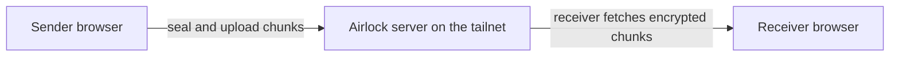

AirDrop works well when two Apple devices are in the same room. Cloud drives are fine when I am willing to hand a file to a company. Taildrop is my default for a quick handoff. I wanted a private inbox for files moving between my own phone, laptop, and desktop, including when the sender closes its browser or the receiver is asleep. That is [Airlock](https://github.com/ahnafnafee/airlock), a self-hosted app that runs on one of my machines and is reachable only inside my Tailscale network.

There is no Airlock account and no public port. A file is sealed in the browser before it is uploaded. The server holds ciphertext, encrypted metadata, and the information it needs to route and resume a transfer; it never receives the passphrase-derived key that can open the file.

  
  

<figure className='not-prose my-8'>
  
  <figcaption className='mt-2 text-center text-sm text-gray-500 dark:text-gray-400'>
    The whole send flow: choose files or a folder, choose a destination, and send.
  </figcaption>
</figure>

## Tailscale is the network boundary

Airlock runs inside a Tailscale network. Tailscale handles identity, private routing, and HTTPS, so the server only listens on the tailnet. An optional approval gate can hold a new device until an existing device admits it.

The server is a small Go binary that embeds the whole client and prints a tailnet URL when it starts. Open that URL on a phone, tablet, or another computer. The browser app can be installed as a PWA, use the share sheet where the platform supports it, and notify a receiver when something arrives. Transfers are store-and-forward: encrypted pieces wait on the server until a recipient collects them, so a device can be asleep or temporarily offline.

## Lock before uploading

Airlock splits a file and encrypts each piece on the sending device before any request carries it across the network. The passphrase is stretched with PBKDF2-SHA256 at 600,000 iterations into a master key. Browser Web Crypto then derives a key for each piece and encrypts it with AES-256-GCM. Filenames, sizes, thumbnails, and the ordered chunk list are sealed too.

The Tailscale-authenticated server can still tell that a known device sent a transfer, its approximate size, and when it happened. It can delete or withhold ciphertext. It does not get the key or plaintext contents. Encryption protects files and metadata at rest on the host, but a compromised server is still visible in the transfer metadata it holds.

## Chunking the file

An opaque blob is a poor fit for a dropped Wi-Fi connection or a file that changes after it has been sent. Airlock uses content-defined chunks. Their boundaries come from the file's bytes instead of a fixed size. Edit the middle of a video and the chunking resynchronizes shortly afterward, without invalidating every chunk that follows.

Each chunk gets an identifier derived from its content and the same secret key. Before uploading, the client asks which encrypted pieces already exist. That check handles several jobs:

- Sending an unchanged file again skips pieces the server already has.

- Resending a file with a small edit uploads only the affected region and the chunks around the new boundaries.

- A dropped connection resumes from the confirmed pieces instead of restarting the full file.

The receiver verifies and decrypts each piece while rebuilding the download. A damaged or substituted piece fails authentication rather than becoming a plausible but wrong file.

  <figure>
    
    <figcaption className='mt-2 text-center text-sm text-gray-500 dark:text-gray-400'>
      The chunk strip makes deduplication visible: green pieces are already available.
    </figcaption>
  </figure>
  <figure>
    
    <figcaption className='mt-2 text-center text-sm text-gray-500 dark:text-gray-400'>
      Arrivals wait in the inbox until a device saves or declines them.
    </figcaption>
  </figure>

## Inbox and retention

Each inbox card lets a recipient save or decline the file. Once a recipient saves it, Airlock clears the transfer from the queue. Uncollected transfers expire after ten minutes by default, with a configurable lifetime for devices that are not always on hand. A small, encrypted history remains after the file is gone, so a device can show what passed through without retaining the file itself.

The PWA asks for notification permission while a device is set up and uses push when the browser supports it. Tapping an alert opens the relevant inbox entry. Platform differences are real, especially on iOS, so the inbox and its unread count remain the reliable fallback.

## One binary and plain web assets

The server and client have different jobs. Go owns Tailscale identity, encrypted-chunk storage, transfer records, expiry, device approval, and notifications. The client is plain browser JavaScript and CSS. Web Crypto handles the key work, workers keep chunking and encryption off the UI thread, IndexedDB holds the non-extractable key material needed by the app and service worker, and the final assets are embedded in the Go binary.

To start it, download a release for Windows, macOS, Linux, or ARM, run `./airlock`, and open the printed tailnet address on two devices. The repository includes a [deployment guide](https://github.com/ahnafnafee/airlock/blob/main/docs/deployment.md), Docker support for a rented server, implementation notes, and measured benchmarks. The source is [MIT-licensed on GitHub](https://github.com/ahnafnafee/airlock).
