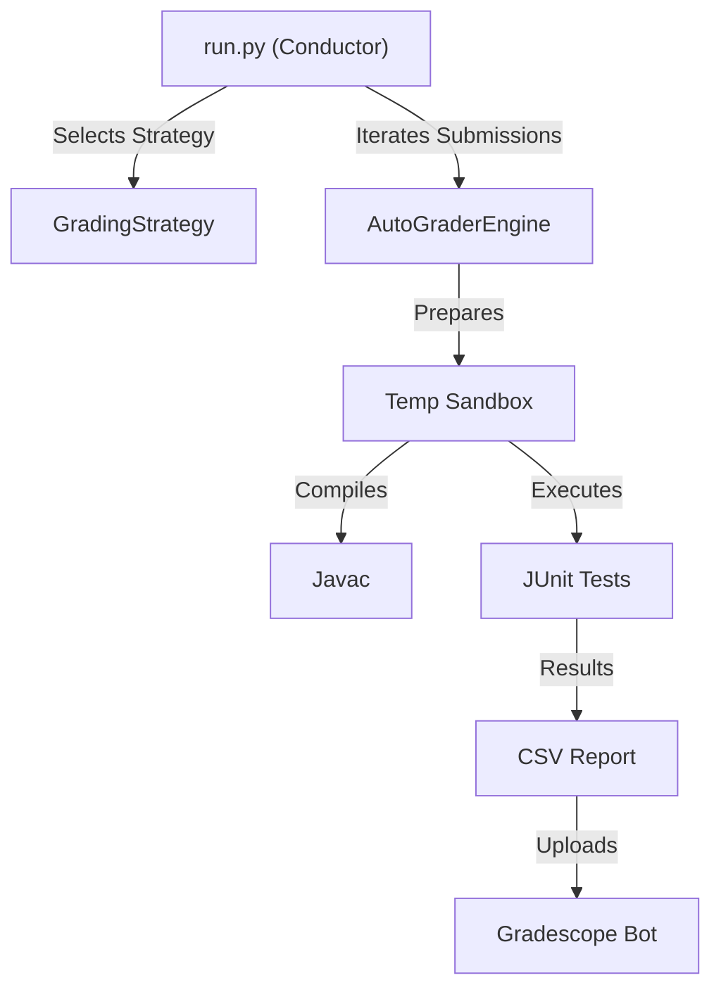
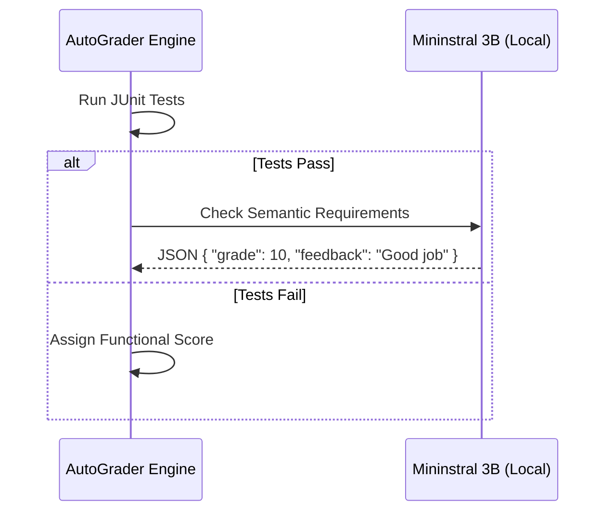

Grading programming assignments provides a unique sandbox to experiment with software architecture. It presents a classic engineering challenge: **how can we build a system that is both flexible enough to handle diverse assignments and robust enough to run at scale?**

This article explores a hobby project of mine where I attempted to engineer a solution using the **Strategy Pattern**, **"Frankenstein" code instrumentation**, and **Local LLMs**. The goal was to see if modern software patterns and local AI could create a "universal" grading engine.

## The Architecture: Python Conductor, Java Engine

The core philosophy is simple: **Python orchestrates, Java executes.**


We use Python for its flexibility in file manipulation, process management, and API interactions. Java is used strictly for running the student's code against JUnit tests.



### The Strategy Pattern

The biggest challenge in building a "universal" grader is that every assignment is different. Some require graph traversal, others list manipulation, and some need strict time complexity checks.

Instead of writing a massive `if-else` block, I used the **Strategy Pattern**. We define a **Parent Strategy** (`GradingStrategy`) that acts as the blueprint. It enforces a contract that all assignments must follow, while also providing shared utility methods (like code preprocessing and penalty calculations) that child strategies can inherit.

```python
# core/grading_strategy.py

from abc import ABC, abstractmethod

# The Parent Strategy
class GradingStrategy(ABC):
    @property
    @abstractmethod
    def assignment_name(self) -> str:
        """Name of the assignment (e.g., 'GraphAssignment')"""
        pass

    @property
    @abstractmethod
    def rubric(self) -> dict:
        """
        Dynamic rubric mapping.
        Keys are test names, values are points.
        """
        pass

    # Shared logic inherited by all child strategies
    def preprocess_code(self, source_code: str) -> str:
        """Optional hook to modify student code before compilation."""
        return source_code
```

```python
# core/strategies/graph_strategy.py

class GraphSearchStrategy(GradingStrategy):
    @property
    def assignment_name(self) -> str:
        return "GraphSearch"
    
    @property
    def rubric(self) -> dict:
        # Maps JUnit test names to point values
        return {
            "testBFS": 15,
            "testDFS": 15,
            "testDijkstra": 20,
            "testEdgeCases": 5
        }

    def preprocess_code(self, source_code: str) -> str:
        # Specific to this assignment: Remove student's main method
        # to prevent it from conflicting with our test harness
        return re.sub(r"public static void main.*?}", "", source_code, flags=re.DOTALL)
```

 This structure allows the main engine (`universal_grader.py`) to be completely agnostic of the assignment details. It treats every assignment as just a generic `GradingStrategy`.

## The "Frankenstein" Method

One of the most complex parts of autograding is testing private methods or ensuring students follow specific implementation details without exposing our test logic.

To solve this, I implemented what I call the **"Frankenstein" Method**. We don't just compile the student's file; we surgically alter it.

In `universal_grader.py`, we extract specific methods from the student's submission and stitch them into a "Frankenstein" class that contains our test harnesses. Crucially, we use regex to flip visibility modifiers so we can test private helper methods directly.

```python
# core/universal_grader.py

def _create_frankenstein_file(self, content_buffer, student_code):
    # ... imports and class definition ...
    
    # The "Frankenstein" Logic: Force visibility to public
    # This allows JUnit to access private helper methods directly
    public_code = re.sub(r"private\s", "public ", student_code)
    public_code = re.sub(r"protected\s", "public ", public_code)
        
    # Track line number offset to map compiler errors back to student's original file
    self.line_offset = len(content_buffer.splitlines())
    content_buffer += f"\n// --- STUDENT CODE START ---\n{public_code}\n"
    
    return content_buffer
```

This allows us to maintain strict interface requirements for students (`private void helper()`) while having full access to test those internals during grading. We also maintain a line offset map so if the compiler fails on line 150 of the Frankenstein file, we can tell the student the error is actually on line 20 of their submission.

## Dynamic Compilation & Loading
 
We compile everything locally in a sandboxed temporary directory to prevent pollution. The system dynamically builds the classpath based on the assignment's needs. We use Python's `subprocess` with a timeout to catch infinite loops (a common issue in student code).

```python
# core/universal_grader.py

# Dynamic Classpath Construction
self.base_jars = ["junit-4.13.1.jar", "hamcrest-core-1.3.jar"]
extra_jars = getattr(self.strategy, "extra_jars", [])

# Constructing the javac command
# Note: We use ';' separator for Windows, ':' for Linux
classpath = ";".join([".", *self.base_jars, *extra_jars])

cmd = ["javac", "-cp", classpath, student_file, tester_file]

try:
    result = subprocess.run(
        cmd, 
        cwd=self.temp_dir,
        capture_output=True,
        text=True,
        timeout=10 # Kill compilation if it freezes
    )
    if result.returncode != 0:
        # Handle compilation error...
        pass
except subprocess.TimeoutExpired:
    self.record_error("Compilation Timed Out")
```

## AI-Assisted Grading with Local LLMs

While JUnit captures functional correctness, it fails at **semantic analysis**. 
- *Did the student comment their code?*
- *Is the variable naming descriptive?*
- *Did they explain their logic in the header?*

To catch these, I integrated a **Local LLM** (Mininstral 3B) running on a local server. When a submission needs semantic checking, we send the code snippets to the LLM with a strict JSON system prompt.

```python
# utils/llm_utils.py

SYSTEM_PROMPT = """
You are a strict grader for a Computer Science course.
Analyze the source code provided.
Output strictly valid JSON with no markdown formatting.
Schema:
{
    "present": boolean, // Is the required info present?
    "feedback": string // Brief feedback for the student
}
"""

def check_student_info(header_text: str) -> dict:
    payload = {
        "model": "mininstral-3b",
        "messages": [
            {"role": "system", "content": SYSTEM_PROMPT},
            {"role": "user", "content": f"Check for Student Name/ID in:\n{header_text}"}
        ],
        "temperature": 0.1 # Low temp for deterministic outputs
    }
    
    response = requests.post("http://localhost:3002/v1/chat/completions", json=payload)
    raw_content = response.json()['choices'][0]['message']['content']
    
    try:
        # Validation Loop: Ensure we got valid JSON back
        return json.loads(raw_content)
    except json.JSONDecodeError:
        # Fallback or retry logic...
        return {"present": False, "feedback": "Error parsing AI response"}
```
 
 

 
This hybrid approach gives us the best of both worlds: the precision of unit tests and the semantic understanding of LLMs, without sending student data to external cloud providers.

## Automating the Last Mile

The final step is getting grades into the system. Manually entering thousands of grades is error-prone. 

I built a **Playwright** bot that:
1.  Reads the final CSV report generated by the `UniversalGrader`.
2.  Logs into the grading portal.
3.  Navigates to each student's submission.
4.  Fills in the rubric and uploads the detailed feedback file.

```python
import os
import csv
import time
from playwright.sync_api import sync_playwright
from dotenv import load_dotenv

# Load credentials
load_dotenv()
EMAIL = os.getenv("GRADESCOPE_EMAIL")
PASSWORD = os.getenv("GRADESCOPE_PASSWORD")

def main():
    with sync_playwright() as p:
        browser = p.chromium.launch(headless=False)  # Visible browser
        context = browser.new_context()
        page = context.new_page()

        # 1. Login
        print("Logging in...")
        page.goto("https://www.gradescope.com/login")
        page.fill("input[name='session[email]']", EMAIL)
        page.fill("input[name='session[password]']", PASSWORD)
        page.click("input[type='submit']")
        page.wait_for_selector("text=Your Courses", timeout=10000)

        # 2. Grading Loop
        print(f"Reading CSV: {CSV_FILE}...")
        # ... read csv logic ...

        for row in rows:
            student_email = row.get("Email")
            
            # Resilience: Ensure we are on the right page
            if page.url != review_grades_url:
                page.goto(review_grades_url)
            
            # Search and Navigate
            page.get_by_placeholder("Search").fill(student_email)
            page.get_by_role("link", name=student_name).first.click()
            
            # Robust Rubric Selection
            def ensure_rubric_item(name_or_index, desired_state=True):
                btn = page.get_by_role("button", name=name_or_index)
                if btn.get_attribute("aria-pressed") != str(desired_state).lower():
                    btn.click()

            # Grade Question 2
            page.get_by_role("link", name="2:").click()
            if float(row.get("Q2 Score")) == 1.0:
                ensure_rubric_item(1, True)
            
            # Submit
            # ... submission logic ...
```

## Conclusion

By treating grading as a software engineering problem, we turned a multi-day ordeal into a process that takes minutes. The combination of the **Strategy Pattern** for extensibility, **Frankenstein** code manipulation for deep testing, and **Local LLMs** for semantic checks creates a robust, scalable system that serves hundreds of students efficiently.
