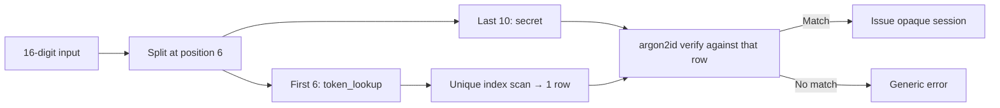

Every book app wants your email. Goodreads wants your social graph. Literal wants your Apple ID. The StoryGraph wants to know how you're feeling. I just wanted to save what I've read, wishlist what I haven't, and search for books — without handing over an identity. So I built [Bookworm](https://bookworm.ahnafnafee.dev/): a privacy-first personal library that authenticates you with a single 16-digit account number, inspired by Mullvad VPN. It runs on Next.js 16, React 19, Drizzle ORM + Neon Postgres, and Tailwind v4 + shadcn/ui — with split-token authentication, Google Books edition deduplication, and cron-pre-warmed caching that keeps third-party API latency away from your first visitor of the day.

## The Problem: Every Book App Wants Your Email

The minimum viable book library is surprisingly small: save books you've read, wishlist books you want to read, and search for new ones. That's three verbs. Yet every app in this space layers on email verification, social feeds, recommendation engines, and account recovery flows — each one a surface for data collection and a friction point at signup.

Mullvad VPN proved a different model works: generate an account number, write it down, done. No email. No password. No "verify your identity" loop. Bookworm applies the same idea to a book library. You get a 16-digit number at signup — shown once, never stored in plaintext, never recoverable — and that's the only credential that exists.

## The Auth Problem: No Email, No Password, No Recovery

The 16-digit token is a CSPRNG-generated number using `crypto.randomInt`. The interesting part isn't generating it — it's storing it safely for lookup without painting a target on the database.

**Why not bcrypt the whole thing?** Bcrypt (or argon2id) hashes the entire token. To verify a login, you'd compare the hash against every row — O(n) argon2id verifications per attempt. At 10K users, that's 10K memory-hard hash comparisons just to log someone in.

**Why not SHA-256 the whole thing?** SHA-256 is fast and indexable — O(1) lookup. But a 10-digit numeric space (the remaining digits after splitting) has ~33 bits of entropy. An attacker with a leaked DB brute-forces that in milliseconds against a fast hash.

**The split-token pattern** solves both. The token is split at position 6: the first 6 digits (`token_lookup`) are stored plaintext and uniquely indexed for O(1) lookup. The remaining 10 digits (`secret`) are argon2id-hashed. One indexed scan narrows the search to exactly one row; one memory-hard verify confirms the match:

```ts
export function splitToken(raw: string): { lookup: string; secret: string } {
    return {
        lookup: raw.slice(0, TOKEN_LOOKUP_LENGTH),
        secret: raw.slice(TOKEN_LOOKUP_LENGTH),
    };
}

export function hashSecret(secret: string): Promise<string> {
    return hash(secret, { memoryCost: 19456, timeCost: 2, parallelism: 1 });
}
```



Sessions are opaque 32-byte IDs stored in Postgres — not JWTs. A JWT is self-validating; you can't revoke it without a revocation list. An opaque ID is deleted on logout, period. Sessions live for 30 days and rotate every 7 days of activity. Rate limits cap signup at 20/hour per IP and login at 10/minute per IP.

## Search That Doesn't Waste Your Time

Raw Google Books returns 40 results for "Dune." Fifteen of them are the same Frank Herbert novel in different editions, and half have no cover thumbnail. The search pipeline in [`lib/books/google.ts`](https://github.com/ahnafnafee/Bookworm/blob/main/lib/books/google.ts) does four things beyond the raw API call:

1. **Query preprocessing** — when no field prefix is detected, the query is wrapped in quotes for exact-phrase ranking. If the user types `intitle:dune`, it passes through untouched.
2. **Edition deduplication** — results are keyed on normalized `title|firstAuthor`. Same key? Keep the edition with the better cover + rating score.
3. **Thumbnail-preferring sort** — results with covers bubble to the top. Nobody clicks a grey placeholder.
4. **Field operators** — users can type `intitle:dune`, `inauthor:"ursula le guin"`, `isbn:9780747532743` directly.

The dedup and ranking logic is ~15 lines:

```ts
function score(b: BookSummary): number {
    return (b.thumbnail ? 10 : 0) + (b.rating ?? 0);
}

function dedupAndRank(items: BookSummary[]): BookSummary[] {
    const seen = new Map<string, BookSummary>();
    for (const item of items) {
        if (!item.title) continue;
        const key = `${normalizeForDedup(item.title)}|${normalizeForDedup(firstAuthor(item.authors))}`;
        const existing = seen.get(key);
        if (!existing || score(item) > score(existing)) {
            seen.set(key, item);
        }
    }
    return Array.from(seen.values()).sort((a, b) => {
        const thumbDiff = (b.thumbnail ? 1 : 0) - (a.thumbnail ? 1 : 0);
        if (thumbDiff !== 0) return thumbDiff;
        return (b.rating ?? 0) - (a.rating ?? 0);
    });
}
```

## Caching: Don't Pay for the Same API Call Twice

Every third-party API call is wrapped in `unstable_cache` from `next/cache`, each with a TTL that matches how often the data actually changes:

| Data | TTL | Why |
| --- | --- | --- |
| NYT Best Sellers | 24 h | Lists update weekly; 1/day is plenty |
| Google Books search | 10 min | Most users repeat queries within a session |
| Book detail | 24 h | Book metadata rarely changes |
| NYT-to-Google mapping | 7 days | Title-to-Google-ID resolution is stable |

Book detail gets an extra in-memory LRU (500 entries) on top of the `unstable_cache` layer — hot-path dedup without paying the cache deserialization cost.

A Vercel Cron hits `/api/cron/warm-nyt` daily at 06:00 UTC, calls `revalidateTag("nyt")`, and refetches. The first real visitor of the day never pays the cold NYT API latency:

```ts
export const searchGoogleBooks = unstable_cache(performSearch, ["google-books-search-v2"], {
    revalidate: 600,
    tags: ["google-books"],
});
```

## Mobile-First, Server-First

The layout is a single `flex-col md:flex-row` container. Below `md:` — bottom tab bar (`BottomNav`) with safe-area padding for iOS, sticky at the bottom, always reachable with one thumb. Above `md:` — a sidebar with logo, nav links, and user menu, hidden on mobile via `md:flex` / `md:hidden`. Both share a single `NAV_ITEMS` array so navigation stays in sync automatically.

All data fetching runs in Server Components. Client components are used only where interactivity is unavoidable — the search form, book detail dialogs, and the theme toggle. Every server action calls `requireUser()`, which re-verifies the session against the database on every request. The proxy (`proxy.ts` — Next.js 16's renamed middleware convention) handles UX redirects only; it is not a security boundary.

## What's Next

- **Import/export** — dump your library as JSON or CSV, import it into a fresh account.
- **Reading stats** — yearly reading goals, pages logged, streak tracking.
- **Shared reading lists** — still privacy-first: share a token to a list, not an email to a platform.
- **Self-hosting guide** — for people who don't want to trust any third-party deployment.

## Try It

Live at [bookworm.ahnafnafee.dev](https://bookworm.ahnafnafee.dev/). Source at [github.com/ahnafnafee/Bookworm](https://github.com/ahnafnafee/Bookworm). No email. No password. Just a number.
