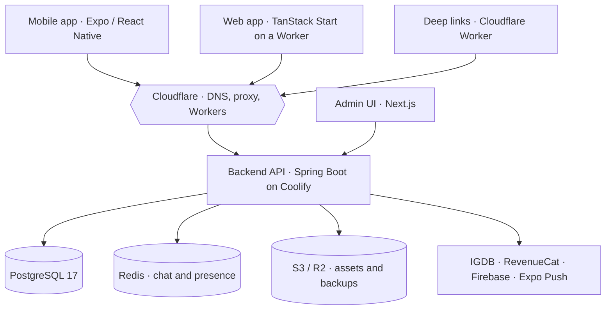

Player 2 is a matchmaking and social app for gamers, and I am the engineer who rebuilt it into what it is today. It is an established Dynasty 11 Studios product with a history before me. My work has been to revamp it end to end, ship it across the App Store and Play Store, and operationalize and scale it. Today I own the full technical stack: the Spring Boot backend, the Expo mobile app, a web client, the admin tools, the deep-link service, and the infrastructure it runs on, along with the app store optimization, localized listings, and analytics loop that keep it growing. This post is a look at what that takes across a real product with real users.

<AppDownloadCTA
  heading='Play Player 2 free'
  subtext='Available on iOS and Android.'
  appStore='https://apps.apple.com/us/app/player-2/id1619655364'
  playStore='https://play.google.com/store/apps/details?id=com.dynasty11.player2app'
/>

## What Player 2 Actually Does

The core idea is simple. Most matchmaking pairs people by rank, which tells you almost nothing about whether you will enjoy playing together. Player 2 matches on personality and playstyle instead, using a short in-app survey, and it only suggests games you both actually own. You link real accounts (Steam, Xbox, PlayStation, Epic, GOG, EA, Battle.net) so the recommendations stay grounded in your real library.

Around that sits a full social product. There is a Looking for Group hub you can filter by region, language, platform, and rank. Communities, which we call Playgrounds, give people a place to organize. A personalized feed called GameHub mixes posts from the people and games you care about. A game library carries critic and player scores, reviews, and trivia. Quests hand out XP and collectibles, and a customizable Player Card pulls cosmetics from an in-app store. Real-time chat and live presence tie it together, and the whole thing is paid for by ads, a PRO subscription, and cosmetic coins.

  
  
  

## The Shape of the System

Player 2 is not one repo. It is eight, split across two GitHub orgs, each with its own stack and its own deploy path. Two of them are clients: the mobile app and the web app. One is the backend everything talks to. The rest are supporting services, meaning the admin tools, the deep links, the infrastructure definitions, and the marketing assets.

Everything public sits behind Cloudflare, which handles DNS, acts as the proxy in front of the backend, and hosts two of the services directly as Workers. The backend owns the data in PostgreSQL, uses Redis for anything that has to be fast or shared across instances, and keeps assets and backups in object storage. Holding that whole picture together is the actual job. The code is the easy part.

## Infrastructure I Own End to End

I do not rent a platform to run this. The backend and admin tools live on Hetzner virtual machines, orchestrated by Coolify, which builds each service straight from a Dockerfile on every push to its deploy branch. There is no external image registry in the path and no separate build farm. Push, build, deploy.

The pieces that benefit from being declarative live in Terraform: the AWS storage bucket and its scoped IAM user, and the whole Grafana Cloud setup, which is the dashboards, the alert rules, and the Discord contact points that page me when something breaks. Observability runs through an OpenTelemetry collector and a blackbox probe into Grafana, so metrics and logs stay portable across vendors instead of locked to one dashboard product.

The part I am most proud of is how much paid tooling I replaced with a little code. Instead of a managed deep-link vendor, I run my own Cloudflare Worker. Instead of a platform-as-a-service bill that scales with growth, I run Coolify on a box I control. The infrastructure repo is not app code at all. It is the operator's manual: bootstrap scripts that stand a fresh machine up from nothing, a hardening runbook, dated audits, and blameless post-mortems, so future me can rebuild the entire environment from zero without guessing.

## The Backend Is a Modular Monolith

The backend is Spring Boot 4 on Java 25, and it is deliberately a modular monolith rather than a pile of microservices. Each domain (players, chat, matchmaking, feed, LFG, store, gamification, and the rest) is its own module with clear boundaries, and modules talk to each other through durable events instead of reaching into one another's internals. That structure gives most of the isolation benefits of microservices without the operational tax of running a dozen of them.

Data lives in PostgreSQL 17 with every schema change managed by Flyway and gated in the build, so the database can never drift away from the code. The API is REST with header-based versioning, which let me ship a second version of an endpoint next to the first without breaking older app builds still out in the wild. Auth is JWT with refresh tokens that rotate on every use. Chat and presence run over STOMP WebSockets, fanned out across instances through Redis pub/sub so a message reaches every device no matter which server it lands on. Virtual threads keep all of that cheap under load.

## Keeping Mobile and Web in Lockstep

The mobile app is Expo and React Native, organized as a monorepo so screens, logic, UI, and assets stay in separate packages that can move at their own pace. State is split on purpose: Redux Toolkit for the things that must persist, and TanStack Query for server data. Every piece of user-facing text runs through translation, and the app ships in English, Arabic, Turkish, and Spanish, with full right-to-left layout for Arabic. Releases go out through EAS with an update policy tied to the version number, so a patch ships as a JavaScript update over the air in minutes while a larger change goes through the stores.

  
  
  

The web client is its own app, not a wrapper around the mobile one. It is a TanStack Start project running on a single Cloudflare Worker that owns both the marketing site and a browser version of the product at close to feature parity with mobile. It shares no React Native code. It reuses the patterns and points at the same API. A few things stay native on purpose, like buying a subscription or linking a console account, because dragging them into the browser would cost more than it returns.

## Deep Links Without Paying for Branch

Deep links look trivial until you try to leave a vendor. When a link has to open the app if it is installed, fall back to the store if it is not, and show a rich preview when someone pastes it into a chat, most teams reach for a paid service. I replaced that with a small Cloudflare Worker on its own subdomain. It renders share previews from backend metadata, redirects based on the device that tapped the link, and serves the platform association files byte for byte identical to the old vendor, so every already-installed app kept working through the switch. Anyone with the app never even sees it.

## Learning From Users Without a Research Team

I never ran a formal usability lab, but the product is full of research if you know where to look. The matchmaking survey is continuous preference data: every answer feeds both who you get matched with and who gets recommended to you. The feed's seen, tap, and dismiss signals are a live read on what is actually landing. Analytics run through Segment, Firebase, and Mixpanel, crash reporting through two independent tools, and I periodically audit the real production database to learn how people use the thing rather than how I imagined they would.

Beta testing goes through TestFlight and Firebase App Distribution before anything reaches the stores, backed by automated end-to-end flows that sign in and click through the core paths on a real emulator. One small detail I am fond of: the app asks for a review at a moment of delight, right after your first accepted match, instead of interrupting you the moment you open it. Timing choices like that are the whole difference between a prompt that helps and one that annoys.

## What Owning the Whole Stack Taught Me

The lesson that surprised me is that writing code was never the bottleneck. The bottleneck is context: how much of the system you can hold at once, and how fast you can move between a database migration, a WebSocket bug, an App Store rejection, and a paywall experiment without losing the thread. Owning the whole stack shaped every call I made. I chose boring, self-hosted tools where they saved money and kept control. I documented obsessively, because documentation is what lets a small team operate this much surface area. And I got comfortable deciding what not to build, which is the real skill, because every yes is paid for by everything else it crowds out.

Player 2 is live on the App Store and Play Store today, in far better shape than I inherited it. If you want the shorter version with just the highlights, the [project page](/portfolio/player2) has it.

<AppDownloadCTA
  heading='Ready to find your Player 2?'
  subtext='Download the app free on iOS and Android.'
  appStore='https://apps.apple.com/us/app/player-2/id1619655364'
  playStore='https://play.google.com/store/apps/details?id=com.dynasty11.player2app'
/>
