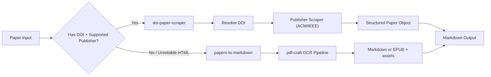
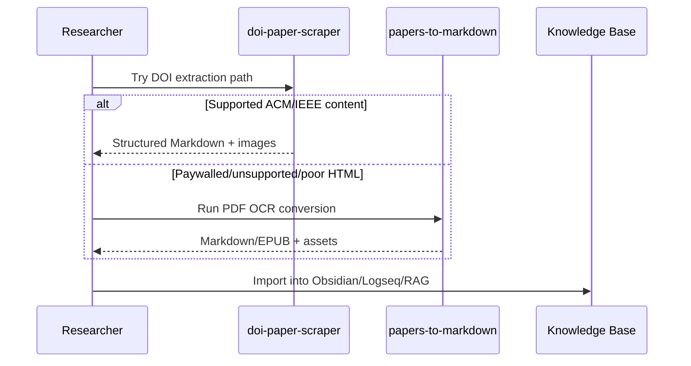

Academic reading workflows are still too fragmented. Some papers are easy to access through DOI landing pages, others are only available as PDFs, and note-taking usually becomes a manual copy-paste process.

I built two complementary tools to fix this:

1. [doi-paper-scraper](https://github.com/ahnafnafee/doi-paper-scraper) for structured extraction from publisher pages (ACM/IEEE).
2. [papers-to-markdown](https://github.com/ahnafnafee/papers-to-markdown) for OCR-based PDF to Markdown/EPUB conversion.

Together, they form a practical pipeline to turn papers into searchable, reusable Markdown for faster literature review.


## Motivation: Why Convert Papers to Markdown?

PDF is excellent for publishing, but weak for daily research workflows:

1. Cross-paper search and linking are harder.
2. Equations/tables are painful to reuse in notes.
3. Versioning and iterative annotation are clunky.
4. Feeding papers into local RAG/NLP pipelines takes extra cleanup.

Markdown solves this by making papers editable, diffable, linkable, and automation-friendly.

## Architecture: DOI-First, OCR-Second



This split is deliberate:

1. Use publisher-native HTML when available (better structure fidelity).
2. Fall back to OCR for PDFs that are hard to scrape or not DOI-accessible.

## Repo 1: How `doi-paper-scraper` Works

The CLI accepts plain DOI strings, DOI URLs, or publisher URLs:

```bash
uv run paper-scrape 10.1145/3746059.3747603
uv run paper-scrape "https://doi.org/10.1109/CSCloud-EdgeCom58631.2023.00053"
```

### Step 1: DOI resolution and publisher routing

`doi_resolver.py` extracts DOI tokens via regex, resolves canonical URLs through `doi.org`, and detects publisher from DOI prefix or resolved domain.

### Step 2: Scraper selection

`get_scraper()` maps publishers to concrete implementations:

- `ACMScraper`
- `IEEEScraper`

Both return a shared `Paper` data model (`title`, `authors`, `abstract`, `sections`, `figures`, `keywords`).

### Step 3: Browser-based acquisition

`BaseScraper` uses `pydoll` to handle real web constraints:

1. cookie injection/saving
2. institutional proxy templating (`%u`, `%h`, `%p`)
3. login detection and wait flow
4. lazy-load scrolling before extraction

### Step 4: Markdown reconstruction

`markdown_builder.py` converts the structured `Paper` object into clean Markdown with headings, abstract, metadata, and inline figures.

## Repo 2: How `papers-to-markdown` Works

This project handles the PDF-first path using `pdf-craft`.

```bash
uv run main.py --format markdown --output-dir markdown
uv run main.py --format epub --output-dir epubs
```

### Core processing flow

1. Discover top-level PDF files under `--root`.
2. Run OCR/analysis with configurable model size (`tiny` to `gundam`).
3. Convert to Markdown or EPUB.
4. Preserve math/tables via renderer settings (notably for EPUB).
5. Store analysis artifacts and model cache in local directories.

### Useful implementation details

- Uses 600 DPI conversion for strong OCR quality.
- Supports `en` and `zh` language settings.
- Includes post-processing for Markdown math delimiters:
  - `\[ ... \]` -> `$$ ... $$`
  - `\( ... \)` -> `$ ... $`

```python
content = output_path.read_text(encoding="utf-8")
content = content.replace("\\\\", "\\")
content = content.replace(r"\[", "$$").replace(r"\]", "$$")
content = content.replace(r"\(", "$").replace(r"\)", "$")
output_path.write_text(content, encoding="utf-8")
```

## Combined Workflow for Research Productivity



The practical result is a robust ingestion strategy:

1. **Fast path**: DOI scraping for clean structure and metadata.
2. **Fallback path**: PDF OCR conversion when web extraction is not ideal.

This reduces manual cleanup and gives a consistent Markdown corpus for reading, annotation, and synthesis.

## Why This Boosts Productivity

| Traditional PDF Workflow | Two-Repo Markdown Workflow |
| :--- | :--- |
| Manual extraction from each paper | Automated DOI/PDF conversion |
| Inconsistent notes across tools | Standardized Markdown outputs |
| Weak figure/equation portability | Reusable assets and math markup |
| Friction for RAG/NLP ingestion | Plain-text-first pipeline |

Less time is spent formatting and locating information. More time is spent comparing methods, writing insights, and moving research forward.

## Conclusion

`doi-paper-scraper` and `papers-to-markdown` solve different sides of the same problem: turning academic content into an active, searchable research format.

If the web page is structured, scrape by DOI. If the paper is locked to PDF or extraction quality is poor, run OCR conversion. In both cases, the destination is the same: high-utility Markdown that improves reading speed and research throughput.

Repositories:

- [DOI Paper Scraper](https://github.com/ahnafnafee/doi-paper-scraper)
- [Papers to Markdown](https://github.com/ahnafnafee/papers-to-markdown)
