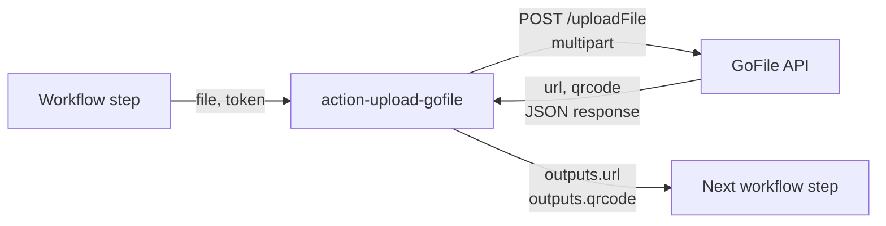

My CI builds produce a lot of files I want to share without ceremony. A 50MB APK on every feature branch, a debug log bundle when a flaky test finally reproduces, a screenshot diff I want my designer to look at. None of these need authentication. They need a public URL someone can click in a Slack message.

So I built [`action-upload-gofile`](https://github.com/ahnafnafee/action-upload-gofile) — a GitHub Action that uploads any file from a workflow to [GoFile.io](https://gofile.io) and returns a public URL plus a QR code as outputs. This post covers why GoFile fit, the API gotchas I hit along the way, and the v3 rewrite when GoFile changed their API in late 2025.

<ProjectLinks
  github='https://github.com/ahnafnafee/action-upload-gofile'
  marketplace='https://github.com/marketplace/actions/upload-to-gofile-io'
/>

## Why a GitHub Action for GoFile

GitHub Actions has built-in `actions/upload-artifact` and `actions/download-artifact` — and for a lot of cases they're the right answer. But they have three properties that make them wrong for "share a build with someone outside the repo":

- **They expire.** Artifacts are deleted after a retention window (default 90 days, often shorter when org policy tightens it).
- **They live inside the workflow run.** Downloading an artifact requires you to be a logged-in GitHub user with read access to the repository.
- **They're scoped to the run, not the world.** There's no public URL — only an authenticated download link gated on the GitHub UI.

S3 or R2 fixes the "public URL" part but introduces its own ceremony: a bucket, an IAM policy, lifecycle rules to clean up old uploads, and the cognitive overhead of remembering which project's bucket is where. For a one-off "send this APK to a tester" job, it's overkill.

GoFile sits in the right slot: anonymous uploads, instant public URLs, optional token for higher rate limits, no infrastructure to set up. The action wraps the upload so the entire flow becomes two lines in a workflow.

## What It Does

`file` in, `url` and `qrcode` out. Both outputs are workflow strings you can consume in any downstream step — log them, post them, embed them in a comment.

There are two inputs:

- `file` (required) — path to the file you want to upload.
- `token` (optional) — a GoFile API token. Anonymous uploads work without it; the token lifts rate limits and gives access to private buckets if you have a GoFile account.

The action is published on the [GitHub Marketplace](https://github.com/marketplace/actions/upload-to-gofile-io) under MIT, so you can audit the source, fork it, and pin to whatever tag your security model wants.

## Using It in a Workflow

```yaml
steps:
  - name: Upload artifact to GoFile
    id: gofile
    uses: ahnafnafee/action-upload-gofile@v3.0.0
    with:
      token: ${{ secrets.GOFILE_TOKEN }}
      file: ./build/app-release.apk

  - name: Post link to PR
    uses: actions/github-script@v7
    with:
      script: |
        github.rest.issues.createComment({
          issue_number: context.issue.number,
          owner: context.repo.owner,
          repo: context.repo.repo,
          body: 'APK: ${{ steps.gofile.outputs.url }}'
        })
```

That's the whole pattern: upload, capture the URL output, hand it to the next step. The QR code output is the same idea — useful when the recipient is going to scan it from their phone to install an APK directly.

## How It Works Under the Hood

The action is about 60 lines of JavaScript running on the `node16` runtime (no Docker, no cold start). The flow is:

1. Read the `file` and optional `token` inputs via `@actions/core`.
2. Build a multipart form body with the file stream and, if present, the token.
3. POST it to GoFile's `/uploadFile` endpoint.
4. Parse the response (`url` and `qrcode` are both server-generated).
5. Set them as workflow outputs with `core.setOutput()`.



There's no retry loop, no chunked upload, no resumable transfer. GoFile's HTTP layer handles enough of that on its own that adding a wrapper would be more risk than benefit for the file sizes this action targets (typically under 500MB).

## Real-World Use Cases

- **APK / IPA distribution.** Push the release artifact to GoFile from the release job; post the URL to your QA Slack channel.
- **PR-comment build previews.** Pair with `actions/github-script` (see the snippet above) and your reviewers get a clickable download link in the PR thread.
- **Screenshot bundles from visual-regression runs.** When a Playwright or Percy run produces a diff folder, zip it, upload, and share the URL with the designer.
- **Debug log handoff.** Failing scheduled jobs can publish their log bundle to GoFile and notify the on-call channel with the link, without bloating Actions artifact storage.

## The v3 Rewrite: When GoFile Changed Their API

In late 2025, GoFile shipped a new API with breaking changes to the upload endpoint and the response shape. The old `v2.x` codepath stopped working. **v3.0.0** (released December 13, 2025) reimplements the upload path against the new API.

The breaking-change story is mostly boring from the action's user-facing perspective — the inputs and outputs didn't change. But if you were pinned to `@v2.1.0` and started seeing `400` responses in your workflow logs in early 2026, that's the explanation: bump to `@v3` and you're back online.

The release cadence going forward is "patch on `@v3` when GoFile changes within the v3 contract; major-bump when they break it again." The repo's [releases page](https://github.com/ahnafnafee/action-upload-gofile/releases) tracks every change.

## Try It Yourself

The action is on the [GitHub Marketplace](https://github.com/marketplace/actions/upload-to-gofile-io) and the source is at [github.com/ahnafnafee/action-upload-gofile](https://github.com/ahnafnafee/action-upload-gofile). Pin to `@v3` for safety patches or `@v3.0.0` if you want manual control over upgrades.

Credits where due: this action extends [@rnkdsh/action-upload-diawi](https://github.com/rnkdsh/action-upload-diawi). The Diawi action's clean output wiring was the template — GoFile API specifics, the QR code output, and the v3 rewrite are this project's contributions.
