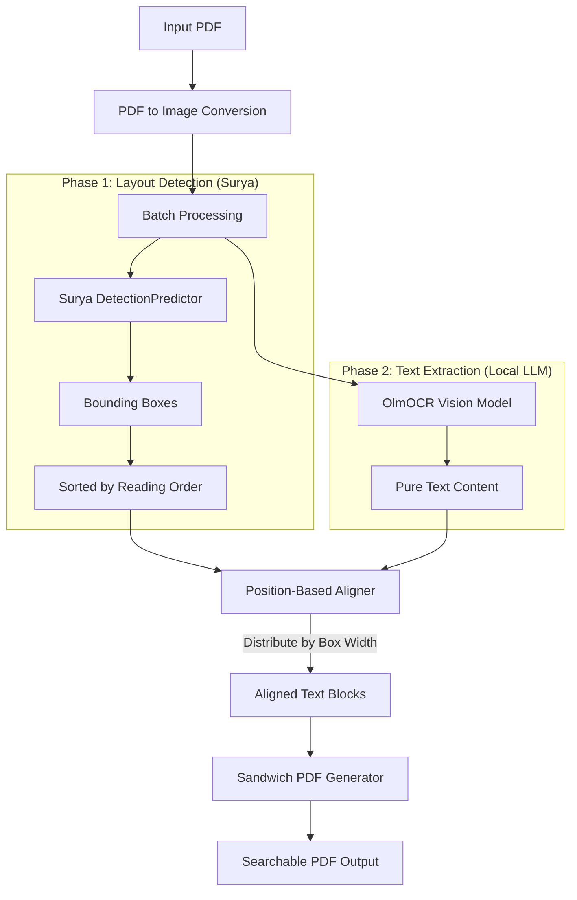
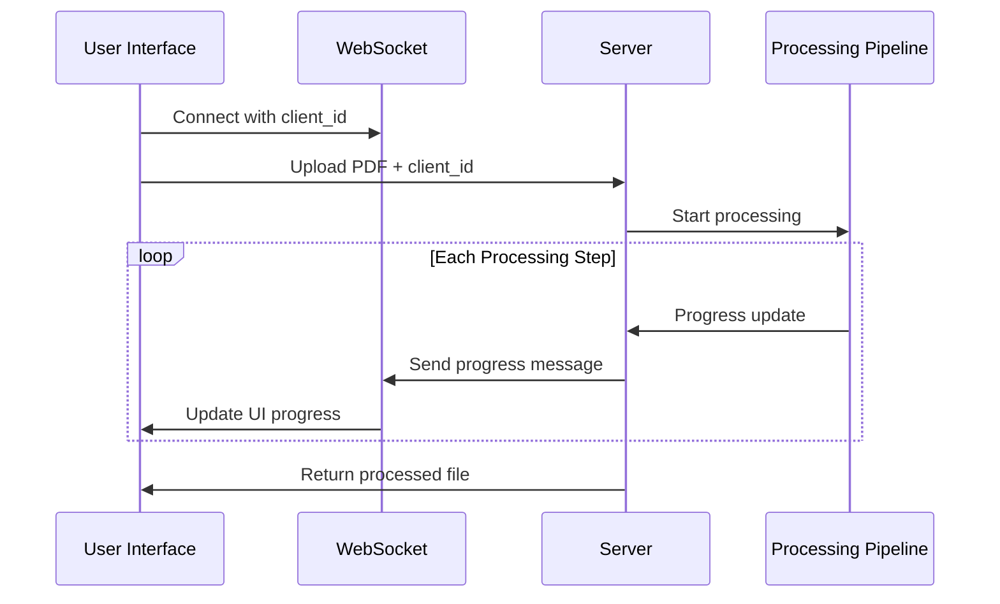

We live in a digital world, yet the most valuable data is often trapped in the analog prison of scanned PDFs. Invoices, handwritten notes, and medical forms are essentially black boxes to our computers; pixels without meaning.

I wanted to solve this. But I didn't want to pay API fees to Cloud Vision providers, and I didn't want my private documents leaving my machine.

This article details how I engineered a **Local, Hybrid OCR Engine** that combines the layout precision of **Surya OCR** with the reasoning capabilities of **OlmOCR (running locally via LM Studio)** to create searchable, indexable PDFs.


## The Problem: The "OCR Triangle"

When building an OCR tool today, you typically pick two:

1.  **Layout Accuracy** (Knowing _where_ the text is).
2.  **Semantic Accuracy** (Knowing _what_ the text says).
3.  **Speed/Cost** (Running it on a laptop).

| Tool                     | Layout            | Semantics                  | Speed               |
| :----------------------- | :---------------- | :------------------------- | :------------------ |
| **Tesseract/EasyOCR**    | ✅ Good           | ❌ Fails on Handwriting    | ⚡ Fast             |
| **Surya Recognition**    | ✅ Excellent      | ⚠️ Moderate on Handwriting | 🐢 Slow (~20s/page) |
| **Surya Detection Only** | ✅ Excellent      | ❌ No text output          | ⚡ Fast (~1s/page)  |
| **OlmOCR (Local LLM)**   | ❌ No coordinates | ✅ Reads Cursive Perfectly | 🐢 Depends on GPU   |

My goal was to break this triangle. I needed the **semantic brains** of the LLM to read the messy handwriting, but the **structural eyes** of Surya's detection to place that text in the correct spot on the PDFs; without the slowness of full recognition.

## The Architecture: "Detection + LLM"


The core innovation is separating **where** (detection) from **what** (LLM). Instead of using slow OCR recognition, we use:

1. **Surya DetectionPredictor** - Just finds text bounding boxes (no recognition)
2. **Local LLM (OlmOCR)** - Reads the actual content with human-like understanding
3. **Position-Based Aligner** - Distributes LLM text across detected boxes

### Why Detection-Only is 10-21x Faster

The key insight is that Surya's recognition step is expensive; it runs a large transformer model on every detected text region. But if the LLM is already giving us perfect text, we don't need recognition at all!

| Document Type | With Recognition | Detection-Only | Speedup |
| ------------- | ---------------- | -------------- | ------- |
| Digital PDF   | 20.38s           | 0.97s          | **21x** |
| Handwritten   | 9.66s            | 1.00s          | **10x** |
| Hybrid Form   | ~11s             | ~1s            | **11x** |



### The Position-Based Alignment Algorithm

Since we no longer have OCR text to match against, we use a simpler but effective strategy: **distribute tokens by box width**.

```python
# hybrid_aligner.py

def align_text(self, structured_data, llm_text):
    """Position-based alignment: distribute LLM tokens across boxes."""
    llm_tokens = llm_text.split()
    boxes = [item[0] for item in structured_data]

    # Calculate width ratios
    total_width = sum(box[2] - box[0] for box in boxes)

    final_output = []
    token_idx = 0

    for i, box in enumerate(boxes):
        # Proportional token allocation
        ratio = (box[2] - box[0]) / total_width
        count = int(round(len(llm_tokens) * ratio))

        chunk = llm_tokens[token_idx : token_idx + count]
        token_idx += count

        final_output.append((box, " ".join(chunk)))

    return final_output
```

This works because:

1. Boxes are **sorted by reading order** (top-to-bottom, left-to-right)
2. Wider boxes naturally contain more text
3. The LLM output follows the same reading order as the visual layout

### Batch Processing for Multi-Page PDFs

For documents with many pages, we batch all images into a single Surya detection call:

```python
# Process ALL pages at once instead of one-by-one
all_image_bytes = [decode(img) for img in images_dict.values()]
all_boxes = hybrid_aligner.get_detected_boxes_batch(all_image_bytes)
```

This reduces per-page overhead and leverages GPU parallelism.

## The "Sandwich" PDF

Once we have aligned the text, we need to embed it. I used `PyMuPDF` to create a "Sandwich PDF".

1.  **Render the Page as an Image**: This strips all existing selectable text (cleaning the slate).
2.  **Insert the Image**: The background is now just pixels.
3.  **Embed Invisible Text**: We take our aligned text and inject it using `render_mode=3` (invisible text).

The font sizing is carefully calculated to fill each bounding box:

```python
# Calculate font size to fill box width, constrained by height
ref_width = font.text_length(text, fontsize=12.0)
width_based_size = (box_width * 0.98) / ref_width * 12.0
height_based_size = box_height * 0.85

# Use the smaller to ensure it fits
target_fontsize = min(width_based_size, height_based_size)
```

This technique means the user sees the original visual document (preserving all fonts and layout), but their cursor interacts with a hidden layer of perfect, searchable text.

## CLI & Real-time Web UI

A tool is only as good as its DX. I implemented a dual-interface approach:


1.  **CLI**: Powered by `rich`, providing beautiful progress bars, spinners, and live status updates.
2.  **Web UI**: A FastAPI backend allows users to drag-and-drop files. I used **WebSockets** to push the exact same rich progress updates to the browser in real-time.

```python
# main.py - Two-phase processing
with progress:
    # Phase 1: Batch layout detection
    task_layout = progress.add_task("[cyan]Detecting layouts (batch)...", total=1)
    all_boxes = hybrid_aligner.get_detected_boxes_batch(all_image_bytes)

    # Phase 2: LLM OCR per page
    task_ocr = progress.add_task(f"[cyan]LLM OCR Processing...", total=total_pages)
    for page_num in page_nums:
        llm_lines = ocr_processor.perform_ocr(image_base64)
        aligned_data = hybrid_aligner.align_text(boxes, llm_lines)
        progress.advance(task_ocr)
```

## Conclusion

This project started as a way to digitize my handwritten notes, but it evolved into a robust case study on **Hybrid AI Systems**.

By separating detection (fast, deterministic) from recognition (slow, semantic), we get the best of both worlds:

-   **Surya DetectionPredictor**: 10-21x faster than full recognition
-   **Local LLM (OlmOCR)**: Human-like reading comprehension
-   **Position-Based Alignment**: Simple but effective text distribution

The result is a tool that feels "native" but possesses the reading comprehension of a state-of-the-art AI; running 100% locally on your machine.

The full source code is available on [GitHub](https://github.com/ahnafnafee/pdf-ocr-llm).

[![zread](https://img.shields.io/badge/Ask_Zread-_.svg?style=for-the-badge&color=00b0aa&labelColor=000000&logo=data%3Aimage%2Fsvg%2Bxml%3Bbase64%2CPHN2ZyB3aWR0aD0iMTYiIGhlaWdodD0iMTYiIHZpZXdCb3g9IjAgMCAxNiAxNiIgZmlsbD0ibm9uZSIgeG1sbnM9Imh0dHA6Ly93d3cudzMub3JnLzIwMDAvc3ZnIj4KPHBhdGggZD0iTTQuOTYxNTYgMS42MDAxSDIuMjQxNTZDMS44ODgxIDEuNjAwMSAxLjYwMTU2IDEuODg2NjQgMS42MDE1NiAyLjI0MDFWNC45NjAxQzEuNjAxNTYgNS4zMTM1NiAxLjg4ODEgNS42MDAxIDIuMjQxNTYgNS42MDAxSDQuOTYxNTZDNS4zMTUwMiA1LjYwMDEgNS42MDE1NiA1LjMxMzU2IDUuNjAxNTYgNC45NjAxVjIuMjQwMUM1LjYwMTU2IDEuODg2NjQgNS4zMTUwMiAxLjYwMDEgNC45NjE1NiAxLjYwMDFaIiBmaWxsPSIjZmZmIi8%2BCjxwYXRoIGQ9Ik00Ljk2MTU2IDEwLjM5OTlIMi4yNDE1NkMxLjg4ODEgMTAuMzk5OSAxLjYwMTU2IDEwLjY4NjQgMS42MDE1NiAxMS4wMzk5VjEzLjc1OTlDMS42MDE1NiAxNC4xMTM0IDEuODg4MSAxNC4zOTk5IDIuMjQxNTYgMTQuMzk5OUg0Ljk2MTU2QzUuMzE1MDIgMTQuMzk5OSA1LjYwMTU2IDE0LjExMzQgNS42MDE1NiAxMy43NTk5VjExLjAzOTlDNS42MDE1NiAxMC42ODY0IDUuMzE1MDIgMTAuMzk5OSA0Ljk2MTU2IDEwLjM5OTlaIiBmaWxsPSIjZmZmIi8%2BCjxwYXRoIGQ9Ik0xMy43NTg0IDEuNjAwMUgxMS4wMzg0QzEwLjY4NSAxLjYwMDEgMTAuMzk4NCAxLjg4NjY0IDEwLjM5ODQgMi4yNDAxVjQuOTYwMUMxMC4zOTg0IDUuMzEzNTYgMTAuNjg1IDUuNjAwMSAxMS4wMzg0IDUuNjAwMUgxMy43NTg0QzE0LjExMTkgNS42MDAxIDE0LjM5ODQgNS4zMTM1NiAxNC4zOTg0IDQuOTYwMVYyLjI0MDFDMTQuMzk4NCAxLjg4NjY0IDE0LjExMTkgMS42MDAxIDEzLjc1ODQgMS42MDAxWiIgZmlsbD0iI2ZmZiIvPgo8cGF0aCBkPSJNNCAxMkwxMiA0TDQgMTJaIiBmaWxsPSIjZmZmIi8%2BCjxwYXRoIGQ9Ik00IDEyTDEyIDQiIHN0cm9rZT0iI2ZmZiIgc3Ryb2tlLXdpZHRoPSIxLjUiIHN0cm9rZS1saW5lY2FwPSJyb3VuZCIvPgo8L3N2Zz4K&logoColor=ffffff)](https://zread.ai/ahnafnafee/local-llm-pdf-ocr)
