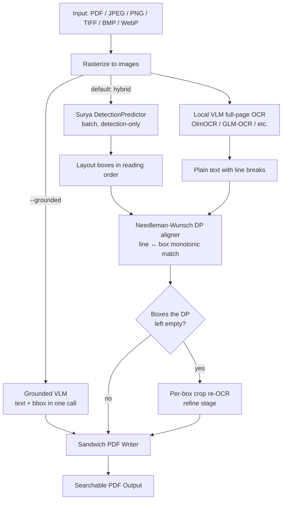

We live in a digital world, yet the most valuable data is still trapped in the analog prison of scanned PDFs. Invoices, handwritten notes, contracts, medical forms, decades-old research archives — pixels without meaning to a machine.

Cloud OCR APIs solve this, but at a cost: your privacy, a per-page bill, and an internet round-trip on every document you process. I wanted none of that.

This is how I engineered a **fully local, privacy-first, hybrid OCR engine** that pairs the surgical layout precision of **Surya** with the semantic understanding of **local Vision Language Models** (OlmOCR, GLM-OCR, Qwen2.5/3-VL) — bound together by a **Needleman-Wunsch dynamic-programming aligner** — to produce searchable PDFs from anything you can rasterize. No cloud. No API keys. No documents leaving your machine.


## The OCR Triangle

When you build OCR today, the literature lets you pick two of three:

1. **Layout accuracy** — knowing _where_ the text lives.
2. **Semantic accuracy** — knowing _what_ the text says.
3. **Speed and privacy** — running it on your laptop, offline.

| Tool                          | Layout            | Semantics                  | Speed / Privacy        |
| :---------------------------- | :---------------- | :------------------------- | :--------------------- |
| **Tesseract / EasyOCR**       | ✅ Good           | ❌ Fails on handwriting    | ⚡ Fast, local         |
| **Surya Recognition**         | ✅ Excellent      | ⚠️ Moderate on cursive     | 🐢 ~20s/page, local    |
| **Surya Detection-Only**      | ✅ Excellent      | ❌ No text output          | ⚡ ~1s/page, local     |
| **Local VLM (OlmOCR-2, Qwen3-VL, GLM-OCR, DeepSeek-OCR)** | ❌ No coordinates | ✅ Reads cursive perfectly | 🐢 GPU-bound, local |
| **Cloud Vision APIs**         | ✅ Good           | ✅ Good                    | ☁️ Not local, not free |

The bet: a vision-language model has the _semantic brain_ to read messy handwriting, but no idea where pixels live on a page. A detection-only Surya pass has _structural eyes_ but nothing to say. **Compose them, and the triangle collapses into a quadrilateral.**

## The Architecture: Two Paths Behind One Seam

The pipeline lives behind a single `OCRPipeline` orchestration seam, with **two execution paths**:

-   **Hybrid path** (default) — works with _any_ OCR-capable VLM, including text-only models.
-   **Grounded path** (opt-in via `--grounded`) — for the new generation of bbox-native VLMs that emit text and coordinates in a single call.


```mermaid
graph TD
    A["Input: PDF / JPEG / PNG / TIFF / BMP / WebP"] --> B["Rasterize to images"]

    B -->|"--grounded"| Z["Grounded VLM<br/>text + bbox in one call"]
    Z --> EMB["Sandwich PDF Writer"]

    B -->|"default: hybrid"| C["Surya DetectionPredictor<br/>batch, detection-only"]
    B --> D["Local VLM full-page OCR<br/>OlmOCR / GLM-OCR / etc."]
    C --> E["Layout boxes in reading order"]
    D --> F["Plain text with line breaks"]
    E --> G["Needleman-Wunsch DP aligner<br/>line ↔ box monotonic match"]
    F --> G
    G --> H{"Boxes the DP<br/>left empty?"}
    H -->|"yes"| R["Per-box crop re-OCR<br/>refine stage"]
    H -->|"no"| EMB
    R --> EMB
    EMB --> L["Searchable PDF Output"]
```

The core insight on both paths is the same: **decouple "where" from "what."** Detection is fast, deterministic, and well-solved. Recognition is slow, semantic, and where modern VLMs shine. Wiring them together cleanly is the entire game.

## Path 1: The Hybrid Pipeline (Surya + LLM + DP Alignment)

The hybrid path is the safe default. It works with _any_ OCR-capable VLM — even ones that can only return plain text — because it never relies on the model knowing geometry.

### Step 1: Batch Layout Detection with Surya

Surya's `DetectionPredictor` runs on every page in **a single batched call**, returning bounding boxes sorted into reading order. We never pay for Surya's recognition step, which is the expensive part of full Surya — running detection-only is roughly **10–21× faster** than full recognition.

```python
# Process ALL pages in one batched detection call
all_image_bytes = [decode(img) for img in images_dict.values()]
all_boxes = hybrid_aligner.get_detected_boxes_batch(all_image_bytes)
```

That single call is amortized across the whole document. On a warm pipeline it finishes in about half a second total — regardless of how many pages you threw at it.

### Step 2: Full-Page Transcription with a Local VLM

Each page image gets handed to a local **OpenAI-compatible** endpoint — LM Studio with `allenai/olmocr-2-7b`, Ollama with `glm-ocr:latest`, vLLM, SGLang, or anything else that speaks the same wire format — with a prompt asking the model to transcribe the entire page.

The VLM doesn't care about coordinates. It just reads the page like a human and returns text. That's its superpower, and the rest of the pipeline is built around exploiting it.

### Step 3: Needleman-Wunsch Alignment — The Heart of the System

This is where it gets interesting. A naive "distribute tokens proportionally to box width" trick works for clean prose but falls apart on tables, multi-column papers, and forms. The fix is to model the problem properly.

You have **N detected boxes** in reading order on the left, and **M LLM lines** in reading order on the right. You need a **monotonic alignment** — every box keeps its position, every line keeps its position, you just decide which line(s) belong to which box (and which boxes are non-text decorations to be skipped entirely).

That is exactly the shape of [Needleman-Wunsch](https://en.wikipedia.org/wiki/Needleman%E2%80%93Wunsch_algorithm) — the same dynamic-programming algorithm that aligns DNA sequences in bioinformatics. The score function:

-   **Rewards** a line whose character count fits a box's width.
-   **Mildly penalizes** skipping a box (many detected boxes are rules, decorations, or page furniture).
-   **Heavily penalizes** skipping a line (LLM text is precious).

Unmatched LLM lines aren't dropped on the floor — they're attached to the nearest matched box, so no semantic content disappears. The DP runs in `O(N × M)` time, which is nothing on a per-page basis.

### Step 4: Per-Box Refine Fallback

Even a good aligner leaves some boxes empty when layouts get pathological — multi-column research papers, dense tables, figure captions floating in whitespace. Rather than tank accuracy, the pipeline crops each empty box and runs **per-box re-OCR** on just that crop.

It catches the hard cases without paying N× latency on clean pages. Disable with `--no-refine` when you're optimizing for throughput on documents you know are clean.

## Path 2: The Grounded Path (One-Shot VLM)

The newest generation of open-weight vision models — **Qwen3-VL** (including the 2026-01-22 Flash snapshot), **GLM-4.6V**, **GLM-OCR** (Z.ai's March 2026 release that tops OmniDocBench V1.5), **DeepSeek-OCR** with its Contexts Optical Compression trick, **InternVL3**, **Chandra-OCR**, **MinerU 2.5**, and **PaddleOCR-VL** — can return **text and bounding boxes in a single JSON response**. When you point the tool at one of these with `--grounded`, the entire hybrid stack collapses into one call:

```bash
uv run main.py scan.pdf --grounded \
    --api-base http://localhost:1234/v1 \
    --model qwen/qwen3-vl-8b
```

No Surya. No DP. No refine. The model returns `{"bbox_2d": [...], "content": "..."}` tuples and the sandwich-PDF writer takes it from there. It's faster, has fewer moving parts, and eliminates the entire DP-alignment class of bugs.

It also requires a model that emits coordinates reliably — which is why the hybrid path remains the default. Hybrid works with _any_ OCR-capable VLM, including the long tail of text-only models. Grounded is the cleaner path when your model can support it.

| Path                       | Detection | Text             | Alignment        | Refine       | When to use                                         |
| :------------------------- | :-------- | :--------------- | :--------------- | :----------- | :-------------------------------------------------- |
| **Hybrid** (default)       | Surya     | LLM full-page    | Needleman-Wunsch | Per-box crop | Any OCR-capable VLM; max coverage                   |
| **Grounded** (`--grounded`) | —         | Bbox-native VLM  | —                | —            | Qwen2.5/3-VL, MinerU; simplest path, fewest bugs    |

## The "Sandwich" PDF — Invisible Text Over Real Pixels

Once we have aligned text and boxes, we embed everything as a **sandwich PDF** with PyMuPDF:

1.  **Rasterize the page as an image** — strips any existing (often broken) text layer, giving us a clean slate.
2.  **Insert the image as the visible background** — what the user sees.
3.  **Overlay invisible text** with `render_mode=3`, geometrically scaled with horizontal-scale matrices so each glyph's bounding box spans the full width of its source region.

That horizontal-scale matrix is the trick that makes selection actually work. Without it, a PDF reader's selection caret jumps in weird places and you get selection runs that look right visually but produce garbage when you copy. With it, dragging your cursor across `INVOICE #4521` highlights _exactly_ that region, character-aligned to the underlying pixels.

The user sees the original document — every font, every annotation, every coffee stain. Their cursor interacts with a perfectly searchable hidden layer they never see.

## Multi-Format Input — Beyond Just PDFs

The pipeline accepts whatever you throw at it:

-   `.pdf` — multi-page handled natively.
-   `.jpg`, `.jpeg`, `.png`, `.bmp`, `.webp` — single-page images skip the PDF round-trip and feed straight into rasterization.
-   `.tif`, `.tiff` — multi-frame TIFFs **expand to one output page per frame**. No manual PDF-wrapping step. This is the format archives, hospitals, and law firms still ship in.

```bash
# Raw image — no PDF required
uv run main.py scan.png scan_ocr.pdf

# Multi-frame TIFF → multi-page searchable PDF
uv run main.py archive.tiff archive_ocr.pdf
```

Output is always a PDF, even when the input isn't.

## Performance: Where the Time Actually Goes

Here's the punchline: **detection is no longer the bottleneck — full-page LLM OCR is.** Once you've offloaded recognition to a VLM, Surya's contribution is rounding error. Warm-run breakdown on an LM Studio + OlmOCR-2-7B + single GPU setup:

| Phase                        | Per-page cost              | Notes                                                            |
| ---------------------------- | -------------------------- | ---------------------------------------------------------------- |
| Rasterize PDF → image        | ~0.3 s                     | Linear in pages                                                  |
| Surya batch detection        | ~0.5 s                     | Amortized across all pages in one batched call                   |
| **LLM full-page OCR**        | **~2–4 s**                 | **Dominant cost.** Parallelize with `--concurrency 3`            |
| Per-box refine (if any)      | ~0.5–1 s × empty boxes     | Typically 0–2 s; disable with `--no-refine`                      |
| PDF assembly                 | ~0.2 s                     | Linear in pages                                                  |
| Cold-start Surya load        | +5–10 s (paid once)        | Paid even on grounded runs                                       |

End-to-end on the example PDFs (hybrid path, OlmOCR-2-7B, warm cache): digital ≈ 14 s, hybrid form ≈ 5 s, handwritten ≈ 4 s. The handwritten case being the cheapest is genuinely funny — fewer detected boxes means a shorter DP, fewer LLM tokens to align, less refine work. Messy is sometimes faster than clean.

`--concurrency` is the lever that matters most. The LLM is the bottleneck and there's nothing stopping you from streaming three pages at once on a beefy GPU.

## CLI & Real-time Web UI

A tool is only as good as its developer experience. The pipeline ships **two interfaces, each rendering the same progress events** so you don't have to learn two mental models.


-   **CLI** — Powered by `rich`, with live progress bars for detection, LLM OCR, refinement, and embedding. Full flag surface for batch automation: `--pages`, `--concurrency`, `--dpi`, `--no-refine`, `--api-base`, `--model`, `--grounded`.
-   **Web UI** — FastAPI + WebSockets, drag-and-drop, dark mode, real-time per-page progress, and an in-browser preview of the raw VLM output _before_ it gets aligned. Same WebSocket events drive both surfaces.

```python
with progress:
    # Phase 1: Batch layout detection (one Surya call for all pages)
    task_layout = progress.add_task("[cyan]Detecting layouts (batch)...", total=1)
    all_boxes = hybrid_aligner.get_detected_boxes_batch(all_image_bytes)

    # Phase 2: LLM OCR per page, with optional concurrency
    task_ocr = progress.add_task(f"[cyan]LLM OCR Processing...", total=total_pages)
    for page_num in page_nums:
        llm_text = ocr_processor.perform_ocr(image_base64)
        aligned_data = hybrid_aligner.align_text(boxes, llm_text)
        progress.advance(task_ocr)
```

## Validating the Whole Thing

Hybrid systems break in subtle ways: a DP edge case, a glyph-scale matrix off by 1.02×, a TIFF frame that gets dropped silently. The repo ships a **145-test suite** covering DP invariants, embedding geometry, grounded JSON parsing, and end-to-end runs against the example PDFs.

There's also a **confidence evaluator** that scores either path against ground-truth fixtures — block recall at IoU ≥ 0.3, average IoU of matched pairs, and average text similarity. Run it against both paths to see which one wins on _your_ document set:

```bash
uv run scripts/confidence_eval.py --path both \
    --grounded-model qwen/qwen3-vl-8b \
    --hybrid-model allenai/olmocr-2-7b
```

That's the honest way to choose between hybrid and grounded — measure it on the documents you actually care about.

## Why This Matters Beyond OCR

This project is, at its heart, a case study in **hybrid AI systems** — the architectural pattern of decomposing a problem into a fast deterministic stage and a slow semantic stage, then binding them together with a classical algorithm.

-   **Surya detection** — fast, deterministic, well-defined contract.
-   **Local VLM** — slow, semantic, the part that actually reads.
-   **Needleman-Wunsch DP** — a 1970 algorithm, still the cleanest tool for monotonic alignment.

Each piece is replaceable. Swap Surya for a different layout model. Swap OlmOCR for Qwen3-VL and flip the `--grounded` switch. Swap the embedder for one that emits HTML or Markdown instead of PDF. The seams are clean because each stage has a crisp contract: "boxes in reading order," "text in reading order," "aligned `(box, text)` pairs."

It also matters for **RAG and document-AI pipelines**. Searchable PDFs are the input format every downstream tool expects — vector-database ingestors, LangChain loaders, enterprise search, Notion imports, knowledge-graph builders. A good local OCR layer is the unglamorous bedrock under all of it. Get the OCR wrong and every downstream embedding inherits the noise; get it right and your retrieval just works.

## Try It Yourself

100% local. No API keys. No subscription fees. Your documents never leave your machine.

The full source is on [GitHub](https://github.com/ahnafnafee/local-llm-pdf-ocr). Stars, issues, and PRs all welcome.

[![zread](https://img.shields.io/badge/Ask_Zread-_.svg?style=for-the-badge&color=00b0aa&labelColor=000000&logo=data%3Aimage%2Fsvg%2Bxml%3Bbase64%2CPHN2ZyB3aWR0aD0iMTYiIGhlaWdodD0iMTYiIHZpZXdCb3g9IjAgMCAxNiAxNiIgZmlsbD0ibm9uZSIgeG1sbnM9Imh0dHA6Ly93d3cudzMub3JnLzIwMDAvc3ZnIj4KPHBhdGggZD0iTTQuOTYxNTYgMS42MDAxSDIuMjQxNTZDMS44ODgxIDEuNjAwMSAxLjYwMTU2IDEuODg2NjQgMS42MDE1NiAyLjI0MDFWNC45NjAxQzEuNjAxNTYgNS4zMTM1NiAxLjg4ODEgNS42MDAxIDIuMjQxNTYgNS42MDAxSDQuOTYxNTZDNS4zMTUwMiA1LjYwMDEgNS42MDE1NiA1LjMxMzU2IDUuNjAxNTYgNC45NjAxVjIuMjQwMUM1LjYwMTU2IDEuODg2NjQgNS4zMTUwMiAxLjYwMDEgNC45NjE1NiAxLjYwMDFaIiBmaWxsPSIjZmZmIi8%2BCjxwYXRoIGQ9Ik00Ljk2MTU2IDEwLjM5OTlIMi4yNDE1NkMxLjg4ODEgMTAuMzk5OSAxLjYwMTU2IDEwLjY4NjQgMS42MDE1NiAxMS4wMzk5VjEzLjc1OTlDMS42MDE1NiAxNC4xMTM0IDEuODg4MSAxNC4zOTk5IDIuMjQxNTYgMTQuMzk5OUg0Ljk2MTU2QzUuMzE1MDIgMTQuMzk5OSA1LjYwMTU2IDE0LjExMzQgNS42MDE1NiAxMy43NTk5VjExLjAzOTlDNS42MDE1NiAxMC42ODY0IDUuMzE1MDIgMTAuMzk5OSA0Ljk2MTU2IDEwLjM5OTlaIiBmaWxsPSIjZmZmIi8%2BCjxwYXRoIGQ9Ik0xMy43NTg0IDEuNjAwMUgxMS4wMzg0QzEwLjY4NSAxLjYwMDEgMTAuMzk4NCAxLjg4NjY0IDEwLjM5ODQgMi4yNDAxVjQuOTYwMUMxMC4zOTg0IDUuMzEzNTYgMTAuNjg1IDUuNjAwMSAxMS4wMzg0IDUuNjAwMUgxMy43NTg0QzE0LjExMTkgNS42MDAxIDE0LjM5ODQgNS4zMTM1NiAxNC4zOTg0IDQuOTYwMVYyLjI0MDFDMTQuMzk4NCAxLjg4NjY0IDE0LjExMTkgMS42MDAxIDEzLjc1ODQgMS42MDAxWiIgZmlsbD0iI2ZmZiIvPgo8cGF0aCBkPSJNNCAxMkwxMiA0TDQgMTJaIiBmaWxsPSIjZmZmIi8%2BCjxwYXRoIGQ9Ik00IDEyTDEyIDQiIHN0cm9rZT0iI2ZmZiIgc3Ryb2tlLXdpZHRoPSIxLjUiIHN0cm9rZS1saW5lY2FwPSJyb3VuZCIvPgo8L3N2Zz4K&logoColor=ffffff)](https://zread.ai/ahnafnafee/local-llm-pdf-ocr)
