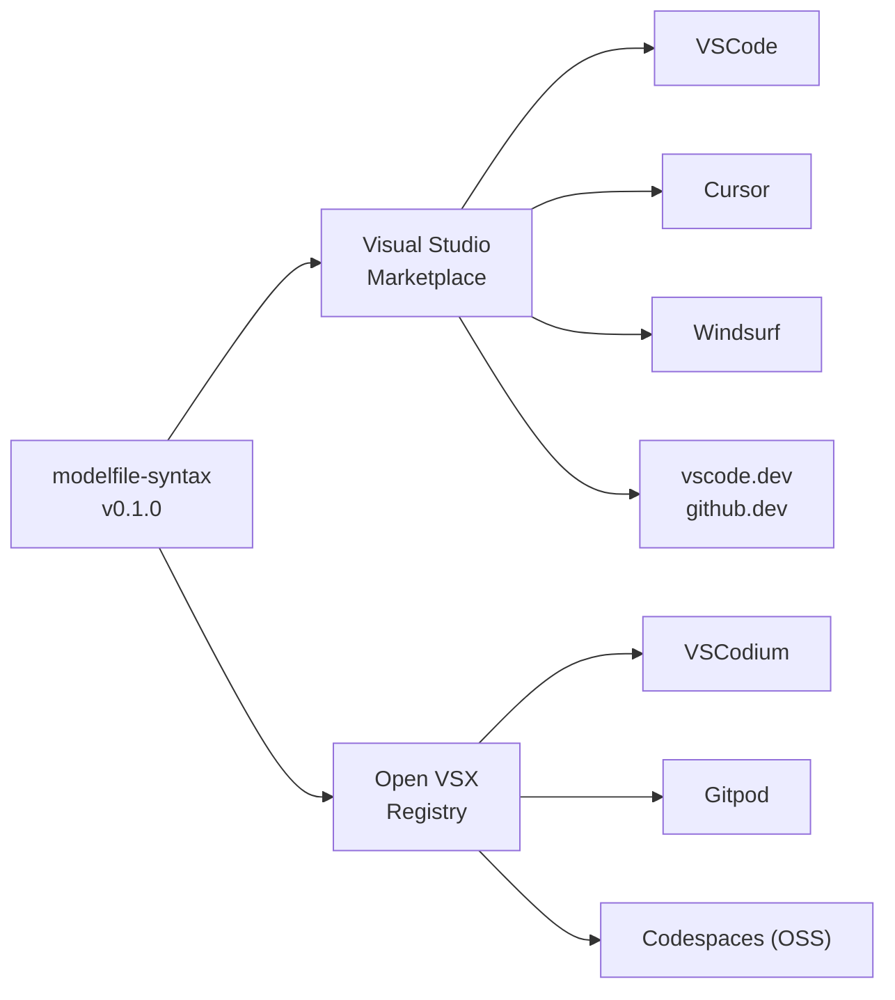

I run a lot of GGUFs locally. Custom system prompts, sampling parameters, conversation primers — all expressed in Ollama Modelfiles. VSCode treated them as plain text: typos in `PARAMETER` names got silently ignored, single-quote `SYSTEM` prompts truncated at the first newline, and `num_ctx` quietly defaulted to 2048 even on models with 32K windows.

So I built [`modelfile-syntax`](https://github.com/ahnafnafee/modelfile-syntax) — a VSCode-family extension with a real grammar, an 18-rule linter, hover docs, autocomplete, and 26+ snippets. This post is the story of what it catches, why it matters, and how it works across every editor you might actually use.

## The Modelfile Footguns I Kept Stepping On

If you've never written one, an Ollama Modelfile is the recipe for a custom local LLM. It declares the base model (a Hugging Face GGUF, an Ollama registry name, or a local path), sets sampling parameters, applies system prompts, defines chat templates in Go template syntax, and optionally pre-loads conversation messages. You then run `ollama create my-model -f Modelfile` and chat with it.

The format is small, terse, and unreasonably easy to get wrong. Four bugs in particular cost me hours before I started annotating my own files with comments like _"DO NOT use single quotes here"_:

**Single-quote truncation.** `SYSTEM "first line\nsecond line"` only ships the first line. The single-quoted form is single-line; multi-line bodies require triple quotes (`"""..."""`). Discovering this means watching your model behave as if half its system prompt vanished — because it did.

**Silently-discarded unknown parameters.** If you write `PARAMETER temprature 0.4` (note the typo), Ollama ignores it. No warning. No error. Your model runs at the default `temperature 0.8` and you wonder why your "deterministic" prompt is generating wildly different outputs.

**The `num_ctx 2048` foot-gun.** Most modern models have 32K, 64K, even 128K context windows. Ollama's default is **2048**. If you don't set `num_ctx` explicitly, your shiny new Llama 3.2 is operating with a context window roughly the size of a long email.

**Invalid MESSAGE roles.** Roles are exactly `system`, `user`, `assistant`. Type `MESSAGE bot ...` or `MESSAGE human ...` and Ollama drops the line. Again, no error. You just don't get your few-shot examples.

Every one of these is a real mistake I've made — sometimes more than once. The linter is, in a real sense, a list of my embarrassing prior selves.

## What "Real Tooling" Means Here

The goal was to bring Modelfiles to feature-parity with what you'd expect from any first-class language in 2026. Five pillars:

1. **TextMate grammar** for syntax coloring — every instruction (`FROM`, `PARAMETER`, `TEMPLATE`, `SYSTEM`, `ADAPTER`, `LICENSE`, `MESSAGE`, `REQUIRES`, `RENDERER`, `PARSER`, `DRAFT`), plus embedded Go template highlighting inside `TEMPLATE """..."""` bodies. Keywords, variables, pipes — all colored.
2. **Real-time linter** with 18 diagnostic rules (`OM001`–`OM018`) — the foot-guns above plus 14 more, each with a stable ID, severity, and an actionable message you can click through.
3. **Hover documentation** on every PARAMETER — type, default, valid range, one-line description, all sourced from the canonical Ollama spec. No more guessing whether `min_p` ranges from 0–1 or 0–100.
4. **Autocomplete** for instruction keywords, PARAMETER names, MESSAGE roles, and Go template variables (`.System`, `.Prompt`, `.Messages`, `.Tools`, `.Response`). Type `PARAMETER ` and the right names show up.
5. **26+ snippets** for the patterns you actually reach for — Llama 3 / Qwen 2.5 / ChatML / Phi-3 chat templates, RAG-grounded system prompts, coder personas, full-file scaffolds.

All of it runs locally. No network calls, no telemetry, no remote model lookups. The whole extension is pure TypeScript with no `child_process` or `fs` dependency, which has a useful downstream property: it works in `vscode.dev` and `github.dev` too.

## Quick Start: From Zero to a Custom Local LLM

Create a file named `Modelfile` (no extension) in your project. The extension activates automatically. Try this:

```modelfile
FROM hf.co/Qwen/Qwen2.5-7B-Instruct-GGUF

PARAMETER temperature 0.4
PARAMETER num_ctx 8192
PARAMETER stop "<|im_end|>"

SYSTEM """You are a concise senior engineer.
Answer in 1–3 sentences. No hedging."""
```

Hover over `temperature` — you'll see its type (`float`), default (`0.8`), recommended range (`≥ 0`), and a one-liner about what it does. Type `PARAMETER ` and you'll get autocomplete for every valid name. Make a typo — `PARAMETER bogus 1` — and a red squiggle (`OM005`) appears immediately.

Or skip all of that: type `modelfile-chat` and press <kbd>Tab</kbd>. You'll get a full chat Modelfile scaffolded out, with cursor stops at every value you need to customize. From there, `ollama create qwen-concise -f Modelfile && ollama run qwen-concise` and you're talking to a local LLM with your exact preferences.

## The 18 Linter Rules: The Greatest Hits

Every rule has a stable ID, a severity (`error` / `warning` / `info`), and a one-line message that tells you what to do. Here are the ones I lean on most:

| ID      | Severity | What It Catches                                                                |
| ------- | -------- | ------------------------------------------------------------------------------ |
| `OM001` | error    | Missing `FROM` instruction.                                                    |
| `OM005` | error    | Unknown `PARAMETER` name (catches `temprature` and friends).                   |
| `OM006` | error    | `PARAMETER` value doesn't match expected type.                                 |
| `OM008` | error    | Invalid `MESSAGE` role (only `system` / `user` / `assistant`).                 |
| `OM011` | warning  | Single-quoted body truncates at newline (use `"""..."""` for multi-line).      |
| `OM012` | warning  | `num_ctx 2048` is the legacy default — your model probably supports more.      |
| `OM014` | warning  | `ADAPTER` got a `.safetensors` / `.bin` / `.pt` file; expects `.gguf`.         |
| `OM016` | error    | Unterminated triple-quoted string.                                             |

Rules you don't want can be silenced per-project: `"modelfileSyntax.lint.disabledRules": ["OM012", "OM015"]` in your VSCode settings. The full list with before/after examples lives in [`docs/rules.md`](https://github.com/ahnafnafee/modelfile-syntax/blob/main/docs/rules.md).

## The Cross-Editor Story: Why This Was Surprisingly Annoying

A VSCode extension can _technically_ run anywhere VSCode runs. In practice, "anywhere" is a minefield. Microsoft's official Visual Studio Marketplace is licensed only to first-party MS products and a few approved partners — VSCodium, OSS Codespaces, and Gitpod cannot install from it. The community answer is **[Open VSX](https://open-vsx.org/extension/ahnafnafee/modelfile-syntax)**, a parallel registry run by the Eclipse Foundation.

If you publish to only one, half your users can't install your thing. So I dual-published, and the deployment graph looks like this:



Same bundle, two registries, eight editors. The pure-TypeScript / no-native-deps constraint is what lets the same `dist/extension.js` run in vscode.dev and github.dev — the moment you touch `child_process` or `fs` you forfeit web compatibility, and a "syntax extension that only works in desktop VSCode" is half a product.

## Install

Pick your editor:

```bash
code --install-extension ahnafnafee.modelfile-syntax       # VSCode
cursor --install-extension ahnafnafee.modelfile-syntax     # Cursor
codium --install-extension ahnafnafee.modelfile-syntax     # VSCodium
```

For Windsurf, Gitpod, Codespaces, vscode.dev, and github.dev: search **"Ollama Modelfile"** in the Extensions panel. Or grab the source: [github.com/ahnafnafee/modelfile-syntax](https://github.com/ahnafnafee/modelfile-syntax).

## What's Next

This is `v0.1` — a complete grammar + linter + hover + completion + snippets release. The roadmap:

- **v0.2** — Markdown / Jinja injection grammars inside `SYSTEM` / `TEMPLATE` bodies, so prompts get their own coloring. Right now the body is one big string; soon it'll be a structured nested grammar.
- **v0.3** — Language Server Protocol mode so Neovim, Helix, and Emacs users get the same linter + hover experience.
- **v0.4** — Optional `ollama create --dry-run` integration for true semantic validation. The current linter is intentionally static — no Ollama CLI calls — so it works offline and in the browser. But the dry-run mode would catch the runtime-only errors (malformed adapter files, unresolvable bases) that no amount of grammar can flag.

## Closing

If you write Modelfiles, this saves you a debugging session. If you write a lot of Modelfiles, it saves you many. Source, issues, and a comparison-vs-other-extensions table all live on [GitHub](https://github.com/ahnafnafee/modelfile-syntax). If it earns its keep, a Marketplace review and a link from your own Modelfile repo is the kindest thing you can do — that's how the Open VSX side of things finds its audience.
