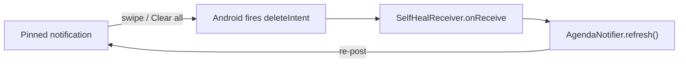
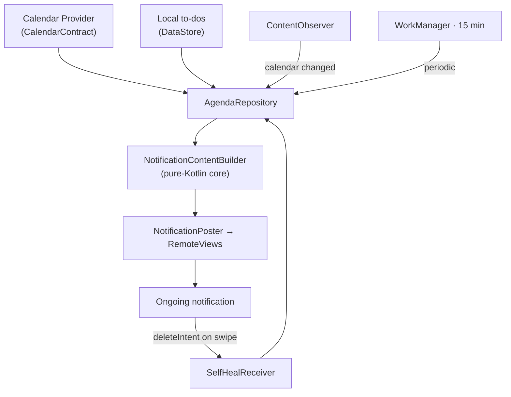

Calendar reminders are too easy to swipe away by accident — and then you forget what's next. So I built **[Pinned Calendar](https://github.com/ahnafnafee/pinned-calendar)**, a privacy-first Android app that keeps this week's Google Calendar events _and_ your to-dos in a single, always-present notification that **re-posts itself the instant you swipe it off**. It reads the calendars already on your phone — no sign-in, no OAuth, and no `INTERNET` permission, so your schedule never leaves the device. Built with Kotlin and Jetpack Compose, it pulls off a self-healing pin with **no foreground service**: a delete-intent broadcast, a `WorkManager` refresh, and a calendar `ContentObserver` do all the work.

## The Problem: Reminders You Can Swipe Into Oblivion

Every reminder system shares one failure mode: it interrupts you at the wrong moment, you flick it away on reflex, and the information goes with it. Heads-up notifications are _designed_ to be dismissed. Widgets solve persistence but lose the home-screen real-estate war — they sit one swipe behind whatever launcher page you aren't looking at.

Pinned Calendar takes a different seat in the house: the notification shade. It posts one ongoing notification — your whole week, grouped by day, color-coded per calendar — and parks it at the top of the drawer where you already look a hundred times a day. Events and tasks share the same surface, and there's nothing to open.

<div className='my-6 flex flex-col items-center justify-center gap-4 sm:flex-row sm:items-start'>
  
  
</div>

## A Notification That Refuses to Die

`setOngoing(true)` keeps the pin out of an ordinary swipe, but Android still lets a determined user — or a _Clear all_ — dismiss it. Rather than fight the platform, I let the dismissal happen and immediately undo it.

Every notification can carry a **delete-intent**: a `PendingIntent` the system fires when the notification is removed. Point it at a `BroadcastReceiver` and a swipe stops being a deletion and becomes a trigger to rebuild.



The builder wires the delete-intent to a receiver and marks the notification ongoing and alert-once, so re-posting it never makes a sound:

```kotlin
val deleteIntent = PendingIntent.getBroadcast(
    context, 1,
    Intent(context, SelfHealReceiver::class.java),
    PendingIntent.FLAG_IMMUTABLE or PendingIntent.FLAG_UPDATE_CURRENT,
)

return NotificationCompat.Builder(context, channelId)
    .setStyle(NotificationCompat.DecoratedCustomViewStyle())
    .setCustomContentView(renderer.collapsed(content))
    .setCustomBigContentView(renderer.expanded(content))
    .setOngoing(true)
    .setOnlyAlertOnce(true)
    .setDeleteIntent(deleteIntent)
    .build()
```

The receiver is almost trivially small — the whole trick is the wiring above:

```kotlin
class SelfHealReceiver : BroadcastReceiver() {
    override fun onReceive(context: Context, intent: Intent?) {
        val pending = goAsync()
        try {
            runBlocking { AgendaNotifier(context).refresh() }
        } finally {
            pending?.finish()
        }
    }
}
```

`goAsync()` is what makes this safe. A `BroadcastReceiver` is normally killed the moment `onReceive` returns, which would cut off the suspend work that reads settings, queries the calendar, and rebuilds the rows. `goAsync()` buys a few extra seconds so the refresh completes before the receiver finishes. From the user's side, a swipe produces a flicker at most — the pin is already back.

## No Internet Permission, No Sign-In

The events on the pin are the events already synced to your phone. Pinned Calendar never talks to Google's servers — it queries Android's **Calendar Provider** through `CalendarContract`, the same content provider the stock Calendar app uses. A single `contentResolver.query` against the `Instances` table, scoped to the time window, returns every event with its title, start time, all-day flag, and per-calendar color:

```kotlin
val uri = CalendarContract.Instances.CONTENT_URI.buildUpon()
    .appendPath(startMillis.toString())
    .appendPath(endMillis.toString())
    .build()

context.contentResolver.query(uri, projection, null, null, "${Instances.BEGIN} ASC")?.use { c ->
    // map each row → AgendaItem(title, start, allDay, calendar color, deep link)
}
```

Because the data already lives on the device, the whole feature needs exactly one dangerous permission — `READ_CALENDAR` — and zero network access. The entire manifest is four permission lines, and `INTERNET` isn't one of them:

```xml
<uses-permission android:name="android.permission.READ_CALENDAR" />
<uses-permission android:name="android.permission.POST_NOTIFICATIONS" />
<uses-permission android:name="android.permission.RECEIVE_BOOT_COMPLETED" />
<uses-permission android:name="android.permission.REQUEST_IGNORE_BATTERY_OPTIMIZATIONS" />
```

Omitting `INTERNET` is the strongest privacy guarantee an Android app can make: the OS itself refuses any socket the app tries to open. There's no sign-in, no OAuth token, no analytics SDK, and — by construction — nothing that _can_ leave the phone.

## Two-Tier Refresh, No Foreground Service

A pin is only useful if it's current. The obvious way to keep a notification fresh is a **foreground service** — but that costs a permanent wakelock and its own second notification, and modern Android actively fights long-running ones. Pinned Calendar skips it entirely and leans on two cheaper signals instead.

While the app's process is alive, a `ContentObserver` registered on `CalendarContract.CONTENT_URI` fires the moment any calendar data changes — add an event in Google Calendar and the pin updates within a second:

```kotlin
private val calendarObserver = object : ContentObserver(Handler(Looper.getMainLooper())) {
    override fun onChange(selfChange: Boolean) {
        AgendaScheduler.refreshNow(this@App)   // process alive → refresh instantly
    }
}

override fun onCreate() {
    super.onCreate()
    AgendaScheduler.schedulePeriodic(this)     // 15-min WorkManager baseline
    AgendaScheduler.refreshNow(this)
    contentResolver.registerContentObserver(CalendarContract.CONTENT_URI, true, calendarObserver)
}
```

For everything that happens when the process _isn't_ alive — time marching forward, an event starting while your phone sits on the nightstand — a `WorkManager` periodic job rebuilds the agenda every 15 minutes. `WorkManager` is the part that survives Doze, app-standby, and reboots; a `BootReceiver` re-arms both the periodic job and an immediate refresh after the device restarts. No foreground service means the pin is nearly free on the battery, and it still comes back after a reboot.

## A Pure-Kotlin Core You Can Actually Test

The trickiest logic in an app like this isn't the Android plumbing — it's the date math. "This week" has to respect the device's first-day-of-week. "Today" and "Tomorrow" headers have to flip at local midnight. All-day events cross time zones in surprising ways. None of that should require an emulator to verify.

So the core is plain Kotlin with no Android imports. `WindowCalculator` turns a window mode into a `[now, end)` epoch-millis range. `DayBucketer` groups events by local date and labels them `TODAY · WED 3`, `TOMORROW · THU 4`, or a bare weekday. `NotificationContentBuilder` assembles the rows the notification renders. Every one of them takes a `java.time.Clock` in its constructor:

```kotlin
class DayBucketer(
    private val clock: Clock,
    private val zone: ZoneId = ZoneId.systemDefault(),
) {
    fun bucket(items: List<AgendaItem>): List<DaySection> { /* … */ }
}
```

Injecting the `Clock` means a test can pin "now" to a fixed instant and assert that an event at 23:59 lands under TODAY while one a minute later rolls to TOMORROW — deterministically, on the JVM, in milliseconds. The repo's unit tests cover the windowing, bucketing, content-building, self-heal, and boot paths; the Android-specific layer (custom `RemoteViews`, the receivers, `WorkManager`) is a thin shell over that tested core. The whole thing is one clean dependency flow:



## Material You, Down to the Notification Rows

The agenda inside the pin isn't a stock notification template — it's custom `RemoteViews` wrapped in `DecoratedCustomViewStyle`, so each row gets its calendar's color as a vertical accent bar, tasks render distinctly from events, and tapping a row deep-links straight into Google Calendar at that event. The settings screen is full Material 3: wallpaper-based dynamic color via [MaterialKolor](https://github.com/jordond/MaterialKolor), hand-picked seed colors, an AMOLED-black option, selectable fonts, and a theme- and accent-adaptive launcher icon.


Notification priority is its own small puzzle. Android won't let you raise a channel's importance once it exists, so each level — Top, Normal, Silent — owns a separate channel with a fixed importance. Switching levels posts on the new channel and retires the others, leaving a single "Pinned agenda" entry in system settings at whatever priority you chose, never a pile of stale channels. Every level stays silent (no sound, no vibration); Top simply uses `IMPORTANCE_HIGH` so the pin ranks above the everyday notification stream.

## Try It

Pinned Calendar is open source under the MIT license. Grab the signed APK from the [latest release](https://github.com/ahnafnafee/pinned-calendar/releases/latest) — no Play Store account needed — grant Calendar and Notification access, flip **Pin to notifications** on, and your week moves into the shade. It runs on Android 8.0 (API 26) and up.

Source, issues, and PRs live at [github.com/ahnafnafee/pinned-calendar](https://github.com/ahnafnafee/pinned-calendar). If a pinned week keeps you on schedule, a ⭐ on the repo genuinely helps.
