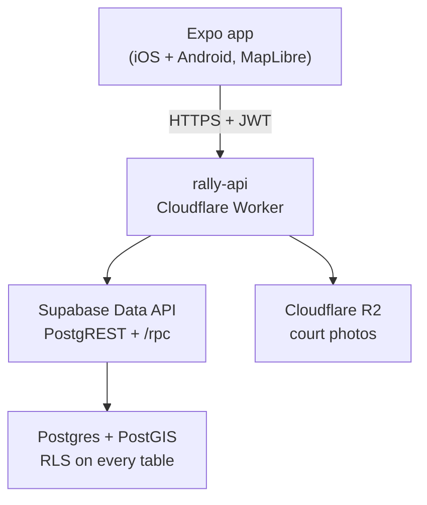

Rally is a mobile app that shows which courts near you are free right now, tennis first, plus pickleball, badminton, and soccer, on one live map. The hard part was never the map. A crowdsourced map is only as good as its worst contributor, so every status report is GPS-verified, a new court needs two independent on-site confirmations before it publishes, and no XP or points are ever minted by the phone. Under the hood it's an Expo and React Native app on Supabase Postgres with PostGIS, fronted by a Cloudflare Worker. Live at [rally.ahnafnafee.dev](https://rally.ahnafnafee.dev).

<AppDownloadCTA
  heading='Get Rally'
  subtext='See which courts near you are free right now.'
  web='https://rally.ahnafnafee.dev'
/>

## Why Another Court App

Static directories tell you a court exists. They don't tell you whether you can play on it in the next ten minutes, which is the only question that matters when you're standing there with a racquet. That answer changes by the hour, and it can only come from someone who is physically at the court. So Rally is built around live status, free / busy / full, reported by players on the ground, plus a map the community can correct when the official data is stale or missing.

<div className='my-6 flex flex-col items-center justify-center gap-4 sm:flex-row sm:items-start'>
  
  
</div>

## The Shape of It

The app is Expo (SDK 56, React Native, expo-router with typed routes, MapLibre for the map, React Query for data). It never talks to the database directly. Every request goes through a small Cloudflare Worker called `rally-api`, which fronts a Supabase Postgres database. Court photos land in Cloudflare R2.



The design choice I'd defend hardest is that the app only ever knows about the proxy. Swap Supabase for something else and the app doesn't change. Move regions, add a cache, or rewrite the data layer, and the client keeps calling the same worker with the same JWT. That indirection costs a few milliseconds and buys the freedom to change everything behind it later.

## Finding Courts Is a Spatial Query

Every court and field is a point with a PostGIS geometry. "44 courts in view" and the "search this area" button are the same operation underneath: give me the published courts whose location falls inside the map's current bounding box, nearest first. Postgres with PostGIS answers that in one indexed query, exposed to the app as a PostgREST RPC. The core lookup is roughly this:

```sql
-- published courts inside the current map viewport, closest first
select *
from courts
where geom && st_makeenvelope(min_lng, min_lat, max_lng, max_lat, 4326)
  and status = 'published'
order by geom <-> st_centroid(
  st_makeenvelope(min_lng, min_lat, max_lng, max_lat, 4326)
);
```

The `&&` bounding-box operator hits the spatial index, so the query stays fast whether the viewport holds four courts or four hundred.

## Keeping the Map Honest

This is the part that makes or breaks a crowdsourced app. If anyone can mark any court "free" from anywhere, the status is noise within a week. So reporting is gated on presence, not on having the app open.

Every status report is tied to a proof-of-presence check-in: your GPS has to put you at the court, or you scan a QR code posted on-site. Adding a brand-new court is stricter still. You drop the pin, set the surface, court count, access, and lights, attach a photo, and submit, as in the second screenshot above. It stays invisible to everyone else until two other players independently confirm it on the ground. One account can't spam courts into existence, and one bored person can't quietly flip a busy court to free.

## The Phone Never Owns the Score

Points have real value in Rally. XP moves you up the ranks (Rookie, then Scout, and up from there), Aces are a currency you spend in a rewards store, and there are seasonal leaderboards. The moment something has value, someone will try to get it for free, and the baseline attacker isn't tapping through your UI. They're running `curl` with a valid token.

So the rule is blunt: the client can request an award, it can never grant one. XP and Aces are written only by server-side functions that first verify the check-in's GPS and the per-user rate limit. Row-level security is on every table, so even a hand-crafted request can only ever touch the caller's own rows.

```sql
-- the ledger is readable by its owner and writable by no client
alter table xp_ledger enable row level security;

create policy "read own ledger" on xp_ledger
  for select using (user_id = auth.uid());

-- there is deliberately no client insert or update policy.
-- awards are written by a security-definer function the worker calls,
-- after it has checked presence and rate limits.
```

The full set of rails is small and boring on purpose:

| Guard                                            | What it stops                                |
| ------------------------------------------------ | -------------------------------------------- |
| GPS or QR proof-of-presence on every check-in    | Reporting a court's status from your couch   |
| Two independent on-site confirmations to publish | One person spamming fake courts onto the map |
| Awards written only by server-side functions     | Minting XP or Aces with a crafted API call   |
| RLS on every table                               | Reading or writing another player's data     |
| Per-user rate limits on costed actions           | Scripted floods farming points               |

None of this is visible to a normal player, which is the whole point. It should feel like a game and be tedious to cheat.

## Gamification Is the Data Strategy

The unglamorous truth of any live-data product is that someone has to keep updating it, forever. Waze solved that for traffic by making reporting feel like play. Rally borrows the idea directly. Daily quests pay out XP for checking in and adding courts. Streaks reward showing up two days running. Badges, ranks, and a seasonal Aces tally turn "keep the map fresh" into something with a scoreboard attached.

<div className='my-6 flex flex-col items-center justify-center gap-4 sm:flex-row sm:items-start'>
  
  
</div>

The gamification is the incentive layer, not a growth-hack bolt-on. It's what produces the fresh data the rest of the app depends on. Take it out and Rally is just another directory that goes stale.

## What's Deliberately Simple

A few things are v1-simple on purpose. Live status is polled, not streamed: the map refetches, it doesn't hold a websocket open. Maps run on MapLibre with Carto vector tiles and an Esri satellite layer, so there's no Google Maps or Mapbox SDK to lock into or pay per-load. Rally Pro, the subscription, goes through RevenueCat, with the entitlement verified server-side instead of trusted from a receipt on the phone. Each of these has an obvious upgrade path if it ever earns one, and none of them were worth building up front.

The map was the easy part. The real work was letting strangers edit it without wrecking it, and making the edits feel worth doing. Rally is live at [rally.ahnafnafee.dev](https://rally.ahnafnafee.dev).

<AppDownloadCTA
  heading='Find your next court with Rally'
  subtext='Live court status, crowdsourced by players on the ground.'
  web='https://rally.ahnafnafee.dev'
/>
