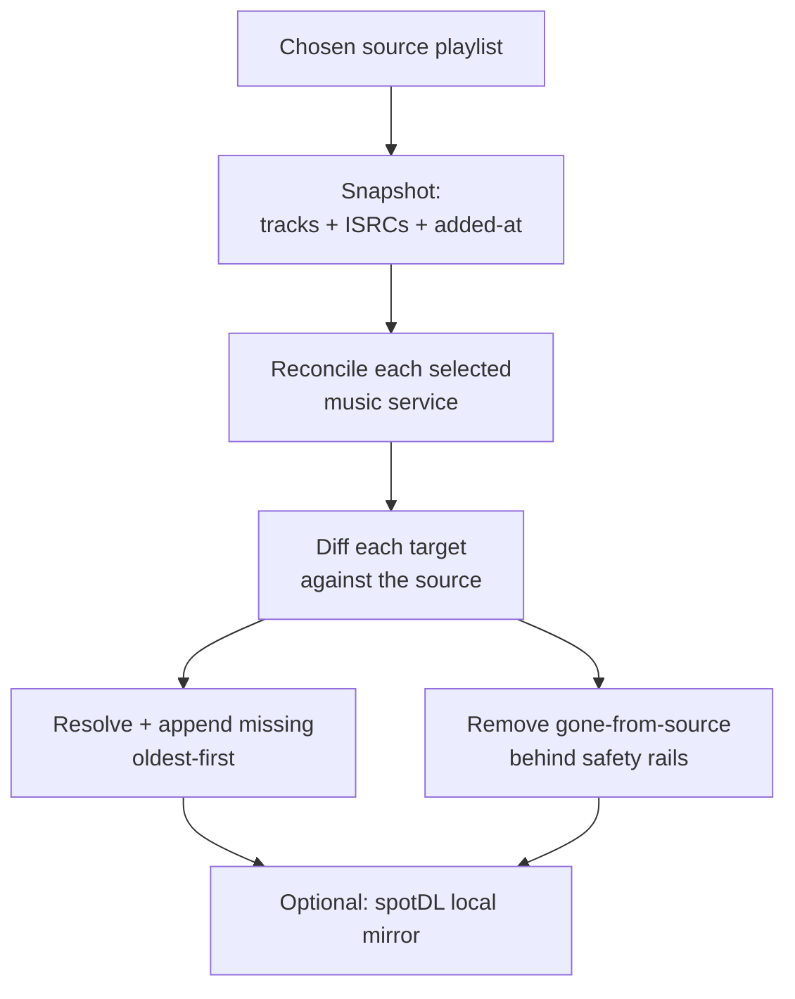

I curate playlists on Spotify but listen elsewhere: Apple Music in the car, YouTube Music for indie uploads, and a Jellyfin server at home when I want the files to be mine. Keeping those playlists identical by hand is work I do once and then stop doing, so I built [SongMirror](https://github.com/ahnafnafee/songmirror). It is a self-hosted web app for Spotify, TIDAL, Qobuz, Deezer, Amazon Music, Apple Music, and YouTube Music, with an optional Jellyfin-ready download mirror. I can create named syncs or run one-off transfers. A sync can use one source of truth, an authoritative group that jointly defines the playlist, or a full N-way set of peers. It uses ISRC-first matching and runs in Docker or as a headless Python CLI.

<div className='not-prose mt-8 mb-6 flex justify-center'>
  
  
</div>

<figure className='not-prose my-6'>
  
  <figcaption className='mt-2 text-center text-sm text-gray-500 dark:text-gray-400'>
    SongMirror end to end: connect a service, build a sync, and transfer a playlist, with every match streaming live.
  </figcaption>
</figure>

## From a script to a browser app

The first version was a Python script for the terminal. The headless CLI still works, but I did not want to connect accounts through environment variables and parse log lines every time I set it up. The browser app uses the same engine. `docker compose up -d` serves it on port 8888 with no `.env` file to edit. Connect each service, create syncs, start transfers, and watch matches, additions, and removals as they stream in.

<figure className='not-prose my-6'>
  
  <figcaption className='mt-2 text-center text-sm text-gray-500 dark:text-gray-400'>
    Connecting services from the browser: each provider gets its own guided, local-only connection flow.
  </figcaption>
</figure>

Connections stay local. The Accounts page guides each service's flow, including a Spotify web-session default and a configurable OAuth callback for remote or reverse-proxy deployments. SongMirror does not proxy credentials through a third party. It writes them to an owner-only local data folder, so listening history stays on the machine.

## Syncs and transfers

A **sync** is an ongoing job. Choose the services, the reconciliation mode, the playlists, and a schedule; SongMirror applies the same rules on every pass. You can create several named syncs, each with its own safety caps, and any supported service can be the source. A **transfer** is a one-off copy from one service to another. It has a live progress bar, pause, resume, and stop controls, plus a panel for tracks that need a manual match.

<figure className='not-prose my-6'>
  
  <figcaption className='mt-2 text-center text-sm text-gray-500 dark:text-gray-400'>
    Setting up a sync: pick the direction, the services, the playlists, and a schedule.
  </figcaption>
</figure>

<figure className='not-prose my-6'>
  
  <figcaption className='mt-2 text-center text-sm text-gray-500 dark:text-gray-400'>
    The dashboard pulls it together: active syncs, service health, and the live activity feed.
  </figcaption>
</figure>

SongMirror can also sync playlists I follow but do not own. A web-player fallback reads them past the dev-mode restriction, so a shared playlist mirrors and transfers like one of my own. The browser app and CLI use the same core. The web layer talks to a small services layer, which owns the event bus and a single-writer queue, so a scheduled sync and a manual transfer do not collide.

## Three ways to decide what belongs

Many existing tools, including Soundiiz and TuneMyMusic, focus on one-shot transfers or append-only sync. They add tracks and rarely remove them. Over time, mirrors drift. A song deleted from Spotify can linger on Apple Music with no clear way to reconcile the two.

In **one-way mode**, one provider is canonical. Spotify is the default, but any connected service can take that role. Every other selected service reflects it. Removals then count as much as additions, so the mirror matches the playlist when tracks disappear too.

The project originally synced Apple Music to Spotify. I flipped it because Spotify's playlist snapshot model lets SongMirror detect a change cheaply and gives the rest of the system a stable reference.

One-way mode is the default, but it is not the only useful model. An **authoritative group** lets two or more services jointly define membership while every other selected service stays destination-only. It is for people who curate the same playlist on Spotify and Apple Music. Additions from either authority propagate, mirrors never get a vote, and removals need two consecutive complete reads before they can delete anything. The group establishes a clean baseline before it removes a track and stops when it cannot read any authority.

There is also an opt-in **N-way** mode that makes every selected service a read-write peer. That is useful when every app is a place you actively edit, rather than simply a place you listen.

## What one pass does

Every one-way pass follows the same shape, whatever the chosen source is:



SongMirror pairs playlists by name and creates a missing target with the source name and description. The browser can also browse and pair playlists that use different names. Services reconcile **concurrently**, but writes within one service stay sequential and rate-limit-friendly, with jittered pacing and exponential backoff on `403` and `429`.

Additions go in **oldest-first** on purpose. Appending one track at a time in added-at order keeps every mirrored playlist sorted by date added, newest last, exactly like the Spotify original.

Everything uses one `MirrorTarget` interface and a shared reconciliation core. Spotify, TIDAL, Qobuz, Deezer, Amazon Music, Apple Music, and YouTube Music implement the same contract. The diffing, ordering, and safety checks live in one place.

## Matching is the hard part

The hard problem is deciding when two entries are the same song across catalogs that mostly don't share a key. The pipeline uses the same hierarchy the cross-service tools ([TuneLink](https://tommcfarlin.com/case-study-tunelink-matching-music-ai/), MusicBrainz) settled on: **hard identifier, then search, then fuzzy score**.

1. **Cached link.** Once a source track resolves to a target catalog ID or video ID, that link is stored and reused. It survives later title drift and makes steady-state passes nearly free.
2. **ISRC.** Exact recording identity wherever both services expose it.
3. **Scored search.** [RapidFuzz](https://rapidfuzz.com/) `token_set_ratio` (order-, subset-, and decoration-tolerant) plus Jaro-Winkler, run over both the raw _and_ romanized ([anyascii](https://github.com/anyascii/anyascii)) title and artist, anchored by duration.

That last stage handles the messy cases without hardcoded exceptions:

| Drift                | Example                                                         | Handled by                                  |
| -------------------- | --------------------------------------------------------------- | ------------------------------------------- |
| Multi-artist credits | `Arijit Singh, Ved Sharma, …` ↔ `Arijit Singh`                  | subset-tolerant `token_set_ratio`           |
| Title decoration     | `Tri` ↔ `Popeye (Bangladesh) - Tri (ত্রি) Official Music Video` | decoration-tolerant score + duration anchor |
| Transliteration      | `Камин` ↔ `Kamin`, `নেশার বোঝা` ↔ `Neshar Bojha`                | anyascii romanization                       |
| Video-only track     | Bangla/indie/OST upload with no catalog song                    | YouTube `videos` filter fallback            |

The **duration anchor** makes the looser title match safe. It accepts subset and decoration differences without over-accepting. A `Runaway - Piano Version` or a wrong-artist cover is rejected when its length disagrees, even if the title looks close. Without that check, a loose title match can silently mirror the wrong recording.

There's a known limit. CJK romanizes to a _Chinese_ reading, so kanji/kana titles that a service only stores in native script can still miss. When nothing clears the bar the track is reported (`x Not on …`) and skipped, never guessed.

## Removals deserve caution

A wrong _add_ is easy to undo; you just delete the track. A wrong _remove_ silently drops a song you wanted, and you might not notice for weeks. So the entire removal path is guarded, and it's the part of the code I'm most careful about:

| Guard                    | What it prevents                                                                        |
| ------------------------ | --------------------------------------------------------------------------------------- |
| Dry run by default       | Any write at all without an explicit `--execute`                                        |
| Empty-snapshot guard     | A transient provider response from emptying a live target                               |
| `MAX_REMOVALS` cap       | A runaway pass mass-deleting; over the cap, removals skip and log                       |
| `MAX_ADDS` cap           | One-burst backfills tripping bot detection; overflow just continues next pass           |
| Fuzzy removal protection | Deleting a target track that plausibly _is_ a source track (feat-credit drift)          |
| Net-loss protection      | Dropping a song that has no match on that service to replace it (`~ held` in the log)   |
| Fail-closed tokens       | Partial deletes when a provider token expires mid-pass; any `401`/`403` aborts the pass |

None of this is clever, which is the point. A delete path that runs unattended against a library I care about should be boring and cautious.

## The local mirror: files you own

Point `DOWNLOAD_DIR` at a music root and SongMirror runs [spotDL](https://github.com/spotDL/spotify-downloader) to keep a local copy of every synced playlist. New tracks download and removed tracks are deleted locally. The layout is Jellyfin-ready:

```text
<DOWNLOAD_DIR>/
  <Playlist>/
    <Playlist>.m3u8         # tool-generated, newest-first
    cover.jpg               # source playlist cover, highest resolution
    <AlbumArtist>/
      <Album>/
        Artist - Title.mp3  # tagged + cover art embedded
```

The `.m3u8` is written by the tool, not spotDL, in date-added order with newest at the top, so Jellyfin shows the latest additions first. Each file's modified time is also stamped to its added-at date, so a Date Modified sort matches.

spotDL can spend _minutes_ re-fetching and re-matching a whole playlist before it reports a single skip, even when nothing changed. SongMirror records a clean pass and skips an unchanged source snapshot entirely, without running spotDL. Only a first-time or changed playlist pays that cost.

One caveat: downloading audio this way sits outside Spotify's ToS. It's for personal use of content you already have access to, so it's your call.

## Cheap re-runs

An always-on mirror needs the common case, nothing changed, to be cheap. SongMirror caches service resolutions, including ISRC and search misses, renders persisted browser data before revalidation, and records every track it sees in a local SQLite archive. Source snapshots make an unchanged playlist cheap to detect without treating a time-based cache expiry as proof that it changed.

The archive also holds hard-identifier links and sync state. After a fully clean pass, an unchanged playlist can be skipped outright. Dry runs never skip or write state, so a plain `uv run main.py` always shows the full picture before you commit to anything.

## N-way sync

One-way is the safe default: the source directs the set, and nothing a mirror does can surprise it. But sometimes I add a track straight from an app and want it to flow back. N-way mode turns the selected services into peers. A track added or removed on any provider propagates to the others.

The hard part of two-way sync is echoes: provider A gets a track, provider B copies it, and next pass B's copy looks like a fresh addition that should flow back to A, forever. The fix is a per-provider canonical snapshot. Each service remembers what it has actually seen, so a track that's merely unmatchable on one service is never mistaken for a deletion there, and a copy that originated elsewhere is never re-announced as new. Additions win ties, a read that collapses to zero tracks is refused, and every removal still clears the same caps and guards as the one-way path.

N-way grants selected services a write role. Leaving it off keeps the source-of-truth model hands-off.

## Keeping it running

The Docker container serves the web UI, runs each sync on its schedule, and restarts with the host. The headless CLI runs a one-shot pass that cron or Windows Task Scheduler can trigger every 15 minutes. I do not run both against the same playlists because two mirrors racing each other can briefly duplicate additions.

Authentication is provider-specific. The browser guides each connection and stores the resulting session locally. Spotify defaults to a saved web session and still supports developer-app OAuth. A remote host or reverse proxy can set its browser-visible base URL so SongMirror advertises the correct callback. When a provider rejects a credential, the pass stops and shows the connection that needs attention instead of continuing into a partial delete.

## Adding a service

Adding a service stays contained. A `MirrorTarget` implementation lists and inspects playlists, resolves tracks, makes the appropriate writes, and reports what it cannot do. The shared core owns the diff, oldest-first ordering, safety rails, logs, summaries, and skip logic. That boundary let SongMirror grow from three catalog integrations to seven without reimplementing the dangerous part each time.

## Try it yourself

The source is on [GitHub](https://github.com/ahnafnafee/songmirror), MIT-licensed. The default is a dry run: it prints every add and remove it _would_ make and writes nothing, so you can point it at your own library and read the whole plan before it touches a single playlist. Stars, issues, and PRs all welcome.
