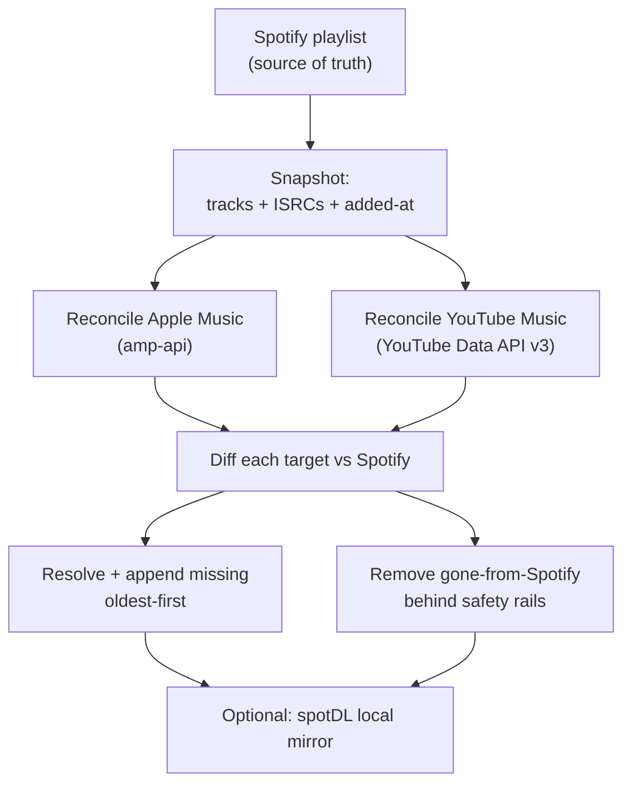

I curate playlists on Spotify but listen everywhere else: Apple Music in the car, YouTube Music for indie uploads, and a Jellyfin server at home when I want the files to be mine. Keeping them identical by hand is a chore you do once and abandon, so I built [omni-playlist-sync](https://github.com/ahnafnafee/omni-playlist-sync). It's now a self-hosted web app: connect Spotify, Apple Music, YouTube Music, and Jellyfin in the browser, build any number of syncs, and run one-off transfers between services. By default it's a one-way mirror with a source of truth (add a song and it appears everywhere in date-added order, remove one and it disappears everywhere), behind safety rails a bad API response can't get past. Flip on N-way mode and every provider becomes a read-write peer. ISRC-first matching, Docker or a headless CLI. Python, MIT.

<div className='not-prose mt-8 mb-6 flex justify-center'>
  
  
</div>

<figure className='not-prose my-6'>
  
  <figcaption className='mt-2 text-center text-sm text-gray-500 dark:text-gray-400'>
    The Omni Sync dashboard: every service, every sync, and a live feed of matches, adds, and removals.
  </figcaption>
</figure>

## From a Script to a Browser App

The first version of this was a Python script you ran from a terminal. It works, and the headless CLI still does, but connecting four services by editing environment variables and reading log lines is not something I wanted to do every time I set it up somewhere. So it's now a self-hosted web app on the same engine. One `docker compose up -d` serves a browser UI on port 8888, no `.env` to edit: connect each service, build your syncs, start transfers, and watch every match, add, and removal stream by live.

<figure className='not-prose my-6'>
  
  <figcaption className='mt-2 text-center text-sm text-gray-500 dark:text-gray-400'>
    Connecting services from the browser: OAuth for Spotify and YouTube Music, a token paste for Apple Music, an API key
    for Jellyfin.
  </figcaption>
</figure>

Connecting is low-ceremony. Spotify and YouTube Music are one-click OAuth, and the wizard prints the exact redirect URI to whitelist. Apple Music takes the two headers you copy out of the web player, no developer account required. Jellyfin takes an API key. Nothing is proxied through a third party, and every credential is written owner-only to a local data folder, so your listening history never leaves the machine.

## Syncs and Transfers

The app splits into two ideas. A **sync** is an ongoing job: pick the services, the direction, the playlists, and a schedule, and it reconciles them every pass. You can run as many named syncs as you like, each with its own safety caps, and the source of truth no longer has to be Spotify. A **transfer** is a one-off copy from one service to another, with a live progress bar and pause, resume, and stop, plus a panel to hand-resolve any track that didn't match automatically.

<div className='not-prose my-6 grid grid-cols-1 items-start gap-4 sm:grid-cols-2'>
  
  
</div>

The browser made one more thing easy: syncing playlists you follow but don't own. A web-player fallback reads them past the dev-mode restriction, so a shared playlist mirrors and transfers like any of your own. And everything the UI does, the CLI still does headless, because both drive the same core: the web layer never touches the engine directly, it goes through a small services layer that owns the event bus and a single-writer queue, so a scheduled sync and a manual transfer can't stomp on each other.

## One Source of Truth

The existing tools in this space (Soundiiz, TuneMyMusic) do one-shot transfers or append-only sync. They add tracks; they rarely remove them. Over months your mirrors drift: a song you deleted from Spotify lingers on Apple Music forever, and there's no clean way to reconcile the two.

The fix was to stop thinking of it as sync and start thinking of it as a mirror. One direction. One provider is canonical (Spotify by default, though one-way mode is provider-agnostic and any service can take that role), and every other service reflects it. That makes removals a first-class operation instead of an afterthought, so the mirror actually matches, subtractions included.

This project actually started out syncing the _other_ way, Apple Music to Spotify, before I flipped it. Spotify's read-only API and its playlist `snapshot_id` model make it the better source of truth: I can watch it for changes cheaply and never risk writing to it by accident.

That one-way model is the default and what most of this post describes. There's also an opt-in mode that relaxes it into a full two-way sync across every provider, which I get to further down.

## What One Pass Does

Every pass, for each playlist name that also exists on Spotify, the flow is the same:



Playlists pair by name, and a missing target is auto-created with Spotify's name and description copied over. Apple and YouTube Music reconcile **concurrently**, but writes within a service stay sequential and rate-limit-friendly, with jittered pacing and exponential backoff on `403`/`429`.

Additions go in **oldest-first** on purpose. Appending one track at a time in added-at order keeps every mirrored playlist sorted by date added, newest last, exactly like the Spotify original.

Everything hangs off a single `MirrorTarget` interface and a shared `mirror_pair` loop. Apple Music and YouTube Music are just two implementations of the same contract, so all the diffing, ordering, and guarding lives in one place.

## Matching Is the Hard Part

The hard problem is deciding when two entries are the same song across catalogs that mostly don't share a key. The pipeline uses the same hierarchy the cross-service tools ([TuneLink](https://tommcfarlin.com/case-study-tunelink-matching-music-ai/), MusicBrainz) settled on: **hard identifier, then search, then fuzzy score**.

1. **Cached link.** Once a Spotify track resolves to an Apple catalog ID or a YouTube `videoId`, that link is stored and reused. It survives later title drift and makes steady-state passes nearly free.
2. **ISRC.** Exact recording identity wherever the service exposes it (Apple does).
3. **Scored search.** [RapidFuzz](https://rapidfuzz.com/) `token_set_ratio` (order-, subset-, and decoration-tolerant) plus Jaro-Winkler, run over both the raw _and_ romanized ([anyascii](https://github.com/anyascii/anyascii)) title and artist, anchored by duration.

That last stage absorbs the real-world mess, none of it hardcoded:

| Drift                | Example                                                         | Handled by                                  |
| -------------------- | --------------------------------------------------------------- | ------------------------------------------- |
| Multi-artist credits | `Arijit Singh, Ved Sharma, …` ↔ `Arijit Singh`                  | subset-tolerant `token_set_ratio`           |
| Title decoration     | `Tri` ↔ `Popeye (Bangladesh) - Tri (ত্রি) Official Music Video` | decoration-tolerant score + duration anchor |
| Transliteration      | `Камин` ↔ `Kamin`, `নেশার বোঝা` ↔ `Neshar Bojha`                | anyascii romanization                       |
| Video-only track     | Bangla/indie/OST upload with no catalog song                    | YouTube `videos` filter fallback            |

The **duration anchor** is what makes the looser, decoration-tolerant title match safe. It lets the score accept subset and decoration differences without over-accepting, so a `Runaway - Piano Version` or a wrong-artist cover whose length disagrees gets rejected even when the titles look close. Loose title matching without a length check is how you silently mirror the wrong recording.

There's a known limit. CJK romanizes to a _Chinese_ reading, so kanji/kana titles that a service only stores in native script can still miss. When nothing clears the bar the track is reported (`x Not on …`) and skipped, never guessed.

## Removals Are Destructive, So the Code Is Paranoid

A wrong _add_ is easy to undo; you just delete the track. A wrong _remove_ silently drops a song you wanted, and you might not notice for weeks. So the entire removal path is guarded, and it's the part of the code I'm most careful about:

| Guard                    | What it prevents                                                                      |
| ------------------------ | ------------------------------------------------------------------------------------- |
| Dry run by default       | Any write at all without an explicit `--execute`                                      |
| Empty-snapshot guard     | A transient "Spotify returned 0 tracks" from emptying a live target                   |
| `MAX_REMOVALS` cap       | A runaway pass mass-deleting; over the cap, removals skip and log                     |
| `MAX_ADDS` cap           | One-burst backfills tripping bot detection; overflow just continues next pass         |
| Fuzzy removal protection | Deleting a target track that plausibly _is_ a Spotify track (feat.-credit drift)      |
| Net-loss protection      | Dropping a song that has no match on that service to replace it (`~ held` in the log) |
| Fail-closed tokens       | Partial deletes when an Apple token expires mid-pass; any `401`/`403` aborts the pass |

None of it is clever, which is fine. A delete path running unattended against a library you care about should be boring and over-cautious.

## The Local Mirror: Files You Own

The optional download mirror is what makes this more than a playlist bridge. Point `DOWNLOAD_DIR` at your music root and each `--execute` pass runs [spotDL](https://github.com/spotDL/spotify-downloader) to keep a local copy of every synced playlist. It's true mirroring here too: new tracks download, removed tracks get deleted locally. The layout is Jellyfin-ready:

```text
<DOWNLOAD_DIR>/
  <Playlist>/
    <Playlist>.m3u8         # tool-generated, newest-first
    cover.jpg               # Spotify playlist cover, highest resolution
    <AlbumArtist>/
      <Album>/
        Artist - Title.mp3  # tagged + cover art embedded
```

The `.m3u8` is written by the tool, not spotDL, in date-added order with newest at the top, so Jellyfin shows your latest additions first the way Spotify does. Each file's modified-time is also stamped to its added-at date, so a Date-Modified sort matches.

One optimization was worth the effort. spotDL spends _minutes_ re-fetching and re-matching a whole playlist before it reports a single skip, and it does that even when nothing changed. So a playlist whose Spotify `snapshot_id` hasn't moved since its last clean download is skipped **entirely**, with no spotDL invocation at all. Only a first-time or changed playlist pays that cost.

One caveat: downloading audio this way sits outside Spotify's ToS. It's for personal use of content you already have access to, so it's your call.

## Near-Instant Re-Runs

An always-on mirror only works if the common case, nothing changed, is cheap. Everything resolvable is cached: per-service resolve caches (ISRC and search results, misses included) and a `spotify_tracks_cache.json` keyed by `snapshot_id`. That key matters, because Spotify's `snapshot_id` changes _exactly_ when the playlist does. Unlike a time-based TTL, there's no staleness window to reason about.

On top of that, `song_cache.db` holds the hard-identifier links and a `sync_state` table. After a fully clean pass, each pair's `snapshot_id` is recorded, and while it's unchanged the pair is skipped outright. Dry runs never skip or write state, so a plain `uv run main.py` always shows the full picture before you commit to anything.

## Going N-Way When You Want It

One-way is the default because it's the safe, boring choice: Spotify stays read-only, and nothing I do on Apple or YouTube can surprise it. But sometimes you add a track straight from the Apple Music app, or thumb one on YouTube Music, and want it to flow back. So there's an opt-in `SYNC_MODE=nway` that turns the mirror into a full peer sync. Spotify, Apple Music, and YouTube Music all become read-and-write, and a track added or removed on any one of them propagates to the other two.

The hard part of two-way sync is echoes: provider A gets a track, provider B copies it, and next pass B's copy looks like a fresh addition that should flow back to A, forever. The fix is a per-provider canonical snapshot. Each service remembers what it has actually seen, so a track that's merely unmatchable on one service is never mistaken for a deletion there, and a copy that originated elsewhere is never re-announced as new. Additions win ties, a read that collapses to zero tracks is refused, and every removal still clears the same caps and guards as the one-way path.

The one real cost is that Spotify stops being read-only: N-way needs the write scopes, so you re-authorize once. Leave the switch alone and nothing changes, Spotify keeps its hands-off, canonical role.

## Keeping It Always-On

Two ways to keep it running. The Docker container is the main one: it serves the web UI and runs every sync on its own schedule, restarting with the host. If you'd rather stay headless, the CLI runs a one-shot pass you can fire from cron or a Windows Task Scheduler task every 15 minutes. Don't run both against the same playlists. Two mirrors racing each other can briefly duplicate adds.

Auth is low-ceremony. In the default one-way mode, Spotify is a one-time OAuth with the read-only `playlist-read-private` scope, so it never writes to Spotify at all; N-way mode adds the write scopes with a one-time re-auth. Apple needs nothing but the two headers you copy out of `music.apple.com`'s network tab, no Apple Developer account required. YouTube Music runs on the official Data API v3 with a durable OAuth refresh token, so unlike the old browser-cookie approach it doesn't expire out from under an unattended mirror. When a token does expire, the pass logs exactly which one to re-capture.

## Adding Another Service Is Eight Methods

Adding a service is deliberately small. To support Tidal or Deezer, you subclass `MirrorTarget` and implement about eight methods (`list_playlists`, `playlist_tracks`, `track_id`, `resolve`, `add`, `remove`, `create`, `is_editable`), then add it to the provider registry. The diff, the oldest-first ordering, every safety rail, the logging, and the snapshot-skip are all inherited from `mirror_pair`. Apple Music, YouTube Music, and Jellyfin are just the implementations that ship today.

## Try It Yourself

The source is on [GitHub](https://github.com/ahnafnafee/omni-playlist-sync), MIT-licensed. The default is a dry run: it prints every add and remove it _would_ make and writes nothing, so you can point it at your own library and read the whole plan before it touches a single playlist. Stars, issues, and PRs all welcome.
